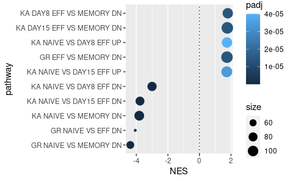

Differential gene-expression analysis CTV data
================
Kaspar Bresser
29/07/2021

-   [DE analysis CTV experiment](#de-analysis-ctv-experiment)
    -   [Performing DE analysis](#performing-de-analysis)
        -   [Volcano plot](#volcano-plot)
    -   [Pathway analysis](#pathway-analysis)
        -   [Plot top/bottom pathways](#plot-topbottom-pathways)
        -   [Plot examples](#plot-examples)

# DE analysis CTV experiment

In the DivisionRecorder manuscript we used a CTV based approach to sort
high- and low-division memory T cells. For each of these populations we
had obtained duplicate cell pools. Each was hash-tagged separately, then
pooled, and subsequently single-cell sequenced using the 10x approach.
Below the analysis pipe-line we used to test gene expression differences
between these two populations.

## Performing DE analysis

First we’ll set everything up so we can perform a differential
gene-expression analysis. Let’s start with loading in the required
packages and load in the Seurat object of this experiment.

``` r
library(here)
library(Seurat)
library(limma)
library(ggrepel)
library(msigdbr)
library(fgsea)
library(ggpubr)
library(tidyverse)

seurat.obj <- read_rds(here("Data", "seurat_object_CTVexp.rds"))
```

Then we can define which hash-tags were allocated to either quiescent or
dividing memory T cells. We’ll take the Hash.IDs, convert them to a
factor, and then collapse the replicate hash-tags. Add them as metadata
to the seurat object.

``` r
seurat.obj@meta.data$hash.ID %>% 
  as.factor %>% 
  fct_collapse(quiescent = c('MSC15-1','MSC15-2'),
               dividing = c('MSC15-3','MSC15-4')) -> tags
summary(tags)
```

    ##   Doublet quiescent  dividing  Negative 
    ##      1781      5249      5937        97

``` r
seurat.obj <- AddMetaData(object = seurat.obj, metadata = tags, col.name = "tags")
```

Now perform DE analysis using `Seurat::FindMarkers`, make sure to set
the identities to the tag identities. Convert the results table to a
tibble.

``` r
Idents(seurat.obj) <- "tags"
marks.tags <- FindMarkers(object = seurat.obj, ident.1 = 'quiescent', ident.2 = 'dividing', 
                          logfc.threshold = 0, test.use = "wilcox", min.pct = 0.1, 
                          slot = "counts")

marks.tags %>% 
  rownames_to_column("genes") %>% 
  as_tibble -> marks.tags

marks.tags
```

    ## # A tibble: 6,034 x 6
    ##    genes       p_val avg_log2FC pct.1 pct.2 p_val_adj
    ##    <chr>       <dbl>      <dbl> <dbl> <dbl>     <dbl>
    ##  1 Rps19   2.97e-134      0.348 0.98  0.983 9.22e-130
    ##  2 Rps20   9.01e-127      0.373 0.986 0.986 2.80e-122
    ##  3 mt-Cytb 1.41e-117      0.313 1     1     4.36e-113
    ##  4 Rps16   4.09e-112      0.289 0.983 0.982 1.27e-107
    ##  5 Rps8    3.21e-110      0.310 0.983 0.983 9.97e-106
    ##  6 Rps29   6.70e- 99      0.300 0.978 0.978 2.08e- 94
    ##  7 Rps24   7.70e- 99      0.268 0.985 0.985 2.39e- 94
    ##  8 Rpl12   2.17e- 97      0.278 0.979 0.982 6.74e- 93
    ##  9 Rplp1   3.86e- 96      0.303 0.976 0.975 1.20e- 91
    ## 10 Tpt1    6.79e- 96      0.253 0.985 0.985 2.11e- 91
    ## # … with 6,024 more rows

``` r
write_tsv(marks.tags, here("Output", "DE_results_CTV.tsv"))
```

### Volcano plot

First we’ll prep the data, adding some thresholds on log2FC and P-value
so we can highlight them later. We’ll also select a few interesting
genes that we can label in the plot.

``` r
select.genes <- c("Bcl11b","Cxcr3" ,"Lgals1", 
                  "S100a4","S100a6","Ccr2",
                  "Id3","Ccr7","Ltb",
                  "Klf3","Id2","Klrk1","Gzmm")

marks.tags %>% 
  mutate(sig = case_when((avg_log2FC < -0.05 | avg_log2FC > 0.05) & p_val_adj < 0.05 ~ "sig",
                         TRUE ~ "ns") )%>% 
  mutate(sig = factor(sig, levels = c("sig", "ns"))) %>% 
  mutate(to.label = genes %in% select.genes) -> to.plot
```

Now we’re ready to plot the volcano. Applied `ggrepel::geom_text_repel`
to add the labels, and added the threshold metrics as dotted lines.

``` r
ggplot(to.plot, aes( y= log10(p_val) , x=avg_log2FC, color = sig, label = genes) ) + 
  geom_point()+
  scale_y_reverse()+
  scale_color_manual(values=c("red", "darkgrey"))+
  geom_text_repel(data = subset(to.plot, to.label == TRUE ), box.padding = 2.3, max.overlaps = 25 )+
  labs(title = "")+
  theme(legend.position = "none", plot.title = element_text(hjust = 0.5))+
  geom_hline(yintercept = log10(1.609564e-06), linetype = "dotted")+
  geom_vline(xintercept = c(0.05, -0.05), linetype = "dotted")+
  xlim(-.5,.6)
```


``` r
ggsave(here("Figs", "Volcano_plot_CTV.pdf"), device = "pdf", width = 4.2, height = 6, useDingbats = F)
```

## Pathway analysis

Now we check if we can find DE pathways. Make use of the `fgsea` package
for pathway testing and the `msigdbr` package to import the pathways.

First import the C7 immunological pathways.

``` r
pathways <- as_tibble(msigdbr(species = "Mus musculus", category = "C7"))

pathways
```

    ## # A tibble: 921,461 x 17
    ##    gs_cat gs_subcat gs_name             entrez_gene gene_symbol human_entrez_ge…
    ##    <chr>  <chr>     <chr>                     <int> <chr>                  <int>
    ##  1 C7     ""        GOLDRATH_EFF_VS_ME…       11305 Abca2                     20
    ##  2 C7     ""        GOLDRATH_EFF_VS_ME…       27416 Abcc5                  10057
    ##  3 C7     ""        GOLDRATH_EFF_VS_ME…       68644 Abhd14a                25864
    ##  4 C7     ""        GOLDRATH_EFF_VS_ME…       11364 Acadm                     34
    ##  5 C7     ""        GOLDRATH_EFF_VS_ME…       11433 Acp5                      54
    ##  6 C7     ""        GOLDRATH_EFF_VS_ME…       66659 Acp6                   51205
    ##  7 C7     ""        GOLDRATH_EFF_VS_ME…       11496 Adam22                 53616
    ##  8 C7     ""        GOLDRATH_EFF_VS_ME…       11513 Adcy7                    113
    ##  9 C7     ""        GOLDRATH_EFF_VS_ME…       54672 Adgrg3                222487
    ## 10 C7     ""        GOLDRATH_EFF_VS_ME…      100986 Akap9                  10142
    ## # … with 921,451 more rows, and 11 more variables: human_gene_symbol <chr>,
    ## #   gs_id <chr>, gs_pmid <chr>, gs_geoid <chr>, gs_exact_source <chr>,
    ## #   gs_url <chr>, gs_description <chr>, species_name <chr>,
    ## #   species_common_name <chr>, ortholog_sources <chr>,
    ## #   num_ortholog_sources <dbl>

The `fgsea` package requires a list input where names refer to pathway
identities, and the values correspond to the genes within that pathway.
We’ll zoom into the pathways deposited by Kaech and Goldrath, as these
are relevant to CD8 T cell function.

``` r
pathways %>% 
  filter(grepl("KAECH|GOLDRATH", gs_name)) -> pathways

pathways <- split(pathways$gene_symbol, pathways$gs_name)

str(pathways)
```

    ## List of 18
    ##  $ GOLDRATH_EFF_VS_MEMORY_CD8_TCELL_DN     : chr [1:200] "Abca2" "Abcc5" "Abhd14a" "Acadm" ...
    ##  $ GOLDRATH_EFF_VS_MEMORY_CD8_TCELL_UP     : chr [1:197] "Adam8" "Ak3" "Anln" "Anxa1" ...
    ##  $ GOLDRATH_NAIVE_VS_EFF_CD8_TCELL_DN      : chr [1:197] "Acot7" "Adam8" "Anln" "Anxa1" ...
    ##  $ GOLDRATH_NAIVE_VS_EFF_CD8_TCELL_UP      : chr [1:199] "Aamp" "Abcc5" "Abcd3" "Abcg1" ...
    ##  $ GOLDRATH_NAIVE_VS_MEMORY_CD8_TCELL_DN   : chr [1:199] "Abcb1a" "Abhd5" "Acot7" "Acy1" ...
    ##  $ GOLDRATH_NAIVE_VS_MEMORY_CD8_TCELL_UP   : chr [1:199] "Acp5" "Actn1" "Actn2" "Acvrl1" ...
    ##  $ KAECH_DAY15_EFF_VS_MEMORY_CD8_TCELL_DN  : chr [1:200] "Aass" "Abhd14a" "Ablim1" "Acp5" ...
    ##  $ KAECH_DAY15_EFF_VS_MEMORY_CD8_TCELL_UP  : chr [1:198] "Actb" "Adam8" "Adck1" "Adcy6" ...
    ##  $ KAECH_DAY8_EFF_VS_DAY15_EFF_CD8_TCELL_DN: chr [1:198] "Aard" "Abcc5" "Abcg1" "Acyp1" ...
    ##  $ KAECH_DAY8_EFF_VS_DAY15_EFF_CD8_TCELL_UP: chr [1:201] "Acot7" "Acot10" "Acot9" "Acsl5" ...
    ##  $ KAECH_DAY8_EFF_VS_MEMORY_CD8_TCELL_DN   : chr [1:198] "Abcg1" "Abhd14a" "Adrb2" "Afm" ...
    ##  $ KAECH_DAY8_EFF_VS_MEMORY_CD8_TCELL_UP   : chr [1:200] "Abracl" "Acsl5" "Acyp2" "Adam8" ...
    ##  $ KAECH_NAIVE_VS_DAY15_EFF_CD8_TCELL_DN   : chr [1:197] "Acot7" "Actb" "Adora2a" "Ahnak" ...
    ##  $ KAECH_NAIVE_VS_DAY15_EFF_CD8_TCELL_UP   : chr [1:197] "Abcc5" "Ablim1" "Acadm" "Acp5" ...
    ##  $ KAECH_NAIVE_VS_DAY8_EFF_CD8_TCELL_DN    : chr [1:199] "Abracl" "Acot7" "Actb" "Acyp2" ...
    ##  $ KAECH_NAIVE_VS_DAY8_EFF_CD8_TCELL_UP    : chr [1:199] "Abcc5" "Abcg1" "Ablim1" "Acyp1" ...
    ##  $ KAECH_NAIVE_VS_MEMORY_CD8_TCELL_DN      : chr [1:198] "Acot7" "Adam19" "Adgre5" "Ahnak" ...
    ##  $ KAECH_NAIVE_VS_MEMORY_CD8_TCELL_UP      : chr [1:200] "Abcg2" "Ablim1" "Acadm" "Actn1" ...

The second input for `fgsea` is a named vector, where names are the
genes, and the values define the enrichment of those genes (log2FC in
this case).

``` r
marks.tags %>% 
  filter(p_val < 0.05) %>%  
  select(genes, avg_log2FC) %>% 
  deframe %>% 
  sort(decreasing = T) -> stats

head(stats, 12)
```

    ##     Rps20     Rps19     Tubb5      Ighm     Plac8      Xist      Ptma   mt-Cytb 
    ## 0.3727391 0.3482220 0.3460743 0.3448983 0.3370942 0.3292697 0.3183398 0.3129312 
    ##   Rpl22l1     Rps17      Rps8     Rplp1 
    ## 0.3110261 0.3102356 0.3096146 0.3034483

And now we can perform the GSEA analysis.

``` r
fgseaRes <- fgsea(pathways=pathways, stats=stats, minSize = 10, nPermSimple = 50000) %>% as_tibble
```

    ## Warning in preparePathwaysAndStats(pathways, stats, minSize, maxSize, gseaParam, : There are ties in the preranked stats (0.41% of the list).
    ## The order of those tied genes will be arbitrary, which may produce unexpected results.

    ## Warning in fgseaMultilevel(...): For some pathways, in reality P-values are less
    ## than 1e-10. You can set the `eps` argument to zero for better estimation.

``` r
fgseaRes
```

    ## # A tibble: 18 x 8
    ##    pathway                pval      padj  log2err     ES   NES  size leadingEdge
    ##    <chr>                 <dbl>     <dbl>    <dbl>  <dbl> <dbl> <int> <list>     
    ##  1 GOLDRATH_EFF_VS_…  6.19e- 6  1.11e- 5  0.611    0.471  1.75   117 <chr [54]> 
    ##  2 GOLDRATH_EFF_VS_…  1.02e- 6  3.07e- 6  0.644   -0.373 -2.49    51 <chr [10]> 
    ##  3 GOLDRATH_NAIVE_V…  1   e-10  3.6 e-10 NA       -0.637 -4.07    43 <chr [21]> 
    ##  4 GOLDRATH_NAIVE_V…  6.05e- 6  1.11e- 5  0.611    0.472  1.74   113 <chr [37]> 
    ##  5 GOLDRATH_NAIVE_V…  1   e-10  3.6 e-10 NA       -0.612 -4.38    67 <chr [30]> 
    ##  6 GOLDRATH_NAIVE_V…  9.31e- 5  1.20e- 4  0.538    0.454  1.67   102 <chr [43]> 
    ##  7 KAECH_DAY15_EFF_…  5.71e- 6  1.11e- 5  0.611    0.477  1.77   118 <chr [43]> 
    ##  8 KAECH_DAY15_EFF_…  4.18e- 1  4.18e- 1  0.00773  0.317  1.05    38 <chr [15]> 
    ##  9 KAECH_DAY8_EFF_V…  6.03e- 3  6.39e- 3  0.0831   0.448  1.57    60 <chr [18]> 
    ## 10 KAECH_DAY8_EFF_V…  4.16e- 3  4.99e- 3  0.0999   0.402  1.48   108 <chr [44]> 
    ## 11 KAECH_DAY8_EFF_V…  4.60e- 6  1.11e- 5  0.611    0.495  1.81    98 <chr [38]> 
    ## 12 KAECH_DAY8_EFF_V…  2.27e- 5  3.23e- 5  0.576   -0.289 -2.11    70 <chr [11]> 
    ## 13 KAECH_NAIVE_VS_D…  1   e-10  3.6 e-10 NA       -0.496 -3.76    77 <chr [31]> 
    ## 14 KAECH_NAIVE_VS_D…  2.19e- 5  3.23e- 5  0.576    0.470  1.73   107 <chr [52]> 
    ## 15 KAECH_NAIVE_VS_D…  1   e-10  3.6 e-10 NA       -0.388 -2.95    81 <chr [22]> 
    ## 16 KAECH_NAIVE_VS_D…  2.33e- 5  3.23e- 5  0.576    0.479  1.75    99 <chr [35]> 
    ## 17 KAECH_NAIVE_VS_M…  1   e-10  3.6 e-10 NA       -0.490 -3.79    88 <chr [35]> 
    ## 18 KAECH_NAIVE_VS_M…  5.87e- 3  6.39e- 3  0.0841   0.408  1.49    92 <chr [41]>

### Plot top/bottom pathways

Filter the results for significant pathways, retain the top and bottom
5, edit the names of the pathways a bit, and plot the results

``` r
fgseaRes %>% 
  # Filter
  filter(padj < 0.05)  %>% 
  filter(dense_rank(NES) <= 5 | dense_rank(desc(NES)) <= 5) %>% 
  # Edit names
  mutate(pathway = gsub("GOLDRATH", "GR", pathway))%>% 
  mutate(pathway = gsub("KAECH", "KA", pathway))%>% 
  mutate(pathway = gsub("_CD8_TCELL", "", pathway))%>% 
  mutate(pathway = gsub("_", " ", pathway)) %>% 
  # Reorder by enrichment value
  mutate(pathway = fct_reorder(as.factor(pathway), NES)) %>% 
  # Plot
  ggplot( aes(x = NES, y = pathway))+
    geom_point(aes(size = size, color  = padj))+
    grids(axis = "y", linetype = "dashed")+
    geom_vline(xintercept = 0, color = "blue", linetype = "dotted")
```



``` r
ggsave(here("Figs", "GSEA_CTV.pdf"),device =  "pdf", height = 3.5, width = 5)
```

### Plot examples

Plot the some example pathways to visualize their enrichment depletion.

Set the pathway to plot, extract the NES value, and plot with
`fgsea::plotEnrichment`

``` r
pw <-  "KAECH_DAY15_EFF_VS_MEMORY_CD8_TCELL_DN"

fgseaRes %>%  
  filter(pathway == pw) %>%  
  pull(NES) %>% 
  round(digits = 2) -> nes

plotEnrichment(pathway = pathways[[pw]], stats)+
  ggtitle(pw)+
  geom_text(aes(label = paste0(c("NES = ", as.character(nes)), collapse = ""),
                x = Inf, y = Inf  ), 
            vjust = "inward", hjust = "inward")
```


``` r
ggsave(here("Figs", "GSEA_Example1.pdf"), device = "pdf", width = 5, height = 3 ,useDingbats = F)
```

``` r
pw <-  "GOLDRATH_NAIVE_VS_EFF_CD8_TCELL_DN"

fgseaRes %>%  
  filter(pathway == pw) %>%  
  pull(NES) %>% 
  round(digits = 2) -> nes

plotEnrichment(pathway = pathways[[pw]], stats)+
  ggtitle(pw)+
  geom_text(aes(label = paste0(c("NES = ", as.character(nes)), collapse = ""),
                x = Inf, y = Inf  ), 
            vjust = "inward", hjust = "inward")
```


``` r
ggsave(here("Figs", "GSEA_Example2.pdf"), device = "pdf", width = 5, height = 3 ,useDingbats = F)
```
