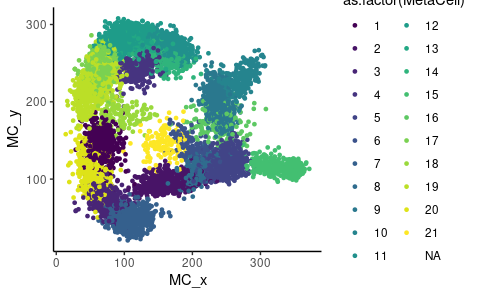
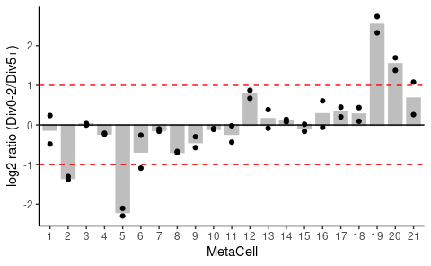
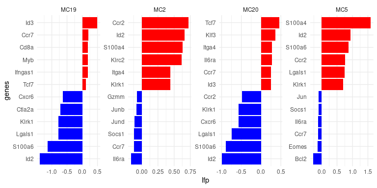

MetaCell-based analysis - CTV data
================
Kaspar Bresser
29/07/2021

-   [Visualize MetaCells](#visualize-metacells)
-   [Plot MetaCell enrichment](#plot-metacell-enrichment)
-   [Plot top/bottom genes](#plot-topbottom-genes)

In the DivisionRecorder manuscript we used a CTV based approach to sort
high- and low-division memory T cells. For each of these populations we
had obtained duplicate cell pools. Each was hash-tagged separately, then
pooled, and subsequently single-cell sequenced using the 10x approach.
Below the analysis pipe-line we used for the MetaCell-based analysis.

MetaCells were generated using the MetaCell\_run.R script in the Scripts
folder.

First load the packages, and files that we’ll be using.

``` r
library(here)
library(metacell)
library(viridis)
library(tidytext)
library(tidyverse)

# Define the folder containing the metacell data objects
scdb_init(here("Data"), force_reinit=T) 

# Import the objects
mc <- scdb_mc("DivRecCTV_MC")
mc2d <- scdb_mc2d("DivRecCTV_MC")
clean.mat = scdb_mat("DivRecCTV_clean")
```

# Visualize MetaCells

Start off with plotting the single cells, and their MetaCell identity on
a 2D plane. The x and y coordinates are stored in the mc2d object.

``` r
str(mc2d)
```

    ## Formal class 'tgMC2D' [package "metacell"] with 6 slots
    ##   ..@ mc_id: chr "DivRecCTV_MC"
    ##   ..@ mc_x : Named num [1:21] 37 141 37 102 267 188 113 211 269 297 ...
    ##   .. ..- attr(*, "names")= chr [1:21] "1" "2" "3" "4" ...
    ##   ..@ mc_y : Named num [1:21] 149 81 55 226 110 166 27 91 202 255 ...
    ##   .. ..- attr(*, "names")= chr [1:21] "1" "2" "3" "4" ...
    ##   ..@ sc_x : num [1:9702(1d)] 84.9 189.8 53.4 111.3 243.6 ...
    ##   .. ..- attr(*, "dimnames")=List of 1
    ##   .. .. ..$ : chr [1:9702] "AAACCCAAGACCATTC-1" "AAACCCAAGATTCGCT-1" "AAACCCACAACCACAT-1" "AAACCCACAGGCTATT-1" ...
    ##   ..@ sc_y : num [1:9702(1d)] 78.7 133.7 210.8 52.8 135 ...
    ##   .. ..- attr(*, "dimnames")=List of 1
    ##   .. .. ..$ : chr [1:9702] "AAACCCAAGACCATTC-1" "AAACCCAAGATTCGCT-1" "AAACCCACAACCACAT-1" "AAACCCACAGGCTATT-1" ...
    ##   ..@ graph:'data.frame':    119 obs. of  2 variables:
    ##   .. ..$ mc1: num [1:119] 1 1 1 1 1 1 2 2 2 2 ...
    ##   .. ..$ mc2: num [1:119] 1 2 3 4 17 18 1 2 3 5 ...

Extract the coordinates from the `sc_x` and `sc_y` slots.

And join with MetaCell identities, these are stored in the `mc` object.

``` r
mc2d@sc_x %>% 
  enframe("cellcode", "MC_x") %>% 
  full_join(enframe(mc2d@sc_y, "cellcode", "MC_y")) %>% 
  left_join(enframe(mc@mc, "cellcode", "MetaCell")) -> coords

coords
```

    ## # A tibble: 9,702 x 4
    ##    cellcode            MC_x  MC_y MetaCell
    ##    <chr>              <dbl> <dbl>    <int>
    ##  1 AAACCCAAGACCATTC-1  84.9  78.7        3
    ##  2 AAACCCAAGATTCGCT-1 190.  134.         6
    ##  3 AAACCCACAACCACAT-1  53.4 211.        18
    ##  4 AAACCCACAGGCTATT-1 111.   52.8        7
    ##  5 AAACCCAGTCGAGTGA-1 244.  135.         5
    ##  6 AAACCCATCCACGAAT-1 241.  117.         5
    ##  7 AAACCCATCCATAAGC-1 305.  111.        15
    ##  8 AAACCCATCGATACGT-1 109.  171.        18
    ##  9 AAACGAAAGACCACGA-1 184.  283.        11
    ## 10 AAACGAAAGCTGACTT-1 248.  132.         5
    ## # … with 9,692 more rows

Make plot the 2d project.

``` r
coords %>% 
  ggplot( aes(MC_x, MC_y, color = as.factor(MetaCell)))+
    geom_point(size = 1)+
    scale_color_viridis_d()+
    theme_classic()
```

    ## Warning: Removed 1 rows containing missing values (geom_point).



``` r
ggsave(here("Figs", "2d_projection_CTV.pdf"), device = "pdf", width = 7,height = 5)
```

    ## Warning: Removed 1 rows containing missing values (geom_point).

# Plot MetaCell enrichment

Next, make visualization to check if less or more divided cells are
enriched in certain MetaCells. The sample hashtags correspond to cells
that were CTV<sup>HI</sup> or CTV<sup>LO</sup>. Extract the hashtag
information from the metadata of the `mat` object and recode the
identifiers to correspond to CTV<sup>HI</sup> or CTV<sup>LO</sup>
populations. The replicates correspond to GFP<sup>-</sup> (i.e. Ai9
cells) and GFP<sup>+</sup> cells.

``` r
clean.mat@cell_metadata %>% 
  rownames_to_column("cellcode") %>% 
  as_tibble() %>% 
  select(cellcode, hash.ID) %>% 
  mutate(hash.ID = fct_recode(hash.ID, 
                              LO_GFP = "MSC15-1", 
                              LO_Ai9 = "MSC15-2", 
                              HI_GFP = "MSC15-3",
                              HI_Ai9 = "MSC15-4")) -> hashtags
hashtags
```

    ## # A tibble: 13,064 x 2
    ##    cellcode           hash.ID
    ##    <chr>              <fct>  
    ##  1 AAACCCAAGACCATTC-1 HI_Ai9 
    ##  2 AAACCCAAGATTCGCT-1 LO_Ai9 
    ##  3 AAACCCAAGGTGATCG-1 Doublet
    ##  4 AAACCCAAGTCCCAGC-1 HI_GFP 
    ##  5 AAACCCACAACCACAT-1 LO_Ai9 
    ##  6 AAACCCACAGGCTATT-1 HI_Ai9 
    ##  7 AAACCCAGTCGAGTGA-1 HI_GFP 
    ##  8 AAACCCATCCACGAAT-1 HI_GFP 
    ##  9 AAACCCATCCATAAGC-1 HI_GFP 
    ## 10 AAACCCATCGATACGT-1 HI_Ai9 
    ## # … with 13,054 more rows

Now join that table with the MetaCell identities, stored in the `mc`
object.

``` r
mc@mc %>% 
  enframe("cellcode", "MetaCell") %>% 
  left_join(hashtags) -> mc.hashtag.table

mc.hashtag.table
```

    ## # A tibble: 9,702 x 3
    ##    cellcode           MetaCell hash.ID
    ##    <chr>                 <int> <fct>  
    ##  1 AAACCCAAGACCATTC-1        3 HI_Ai9 
    ##  2 AAACCCAAGATTCGCT-1        6 LO_Ai9 
    ##  3 AAACCCACAACCACAT-1       18 LO_Ai9 
    ##  4 AAACCCACAGGCTATT-1        7 HI_Ai9 
    ##  5 AAACCCAGTCGAGTGA-1        5 HI_GFP 
    ##  6 AAACCCATCCACGAAT-1        5 HI_GFP 
    ##  7 AAACCCATCCATAAGC-1       15 HI_GFP 
    ##  8 AAACCCATCGATACGT-1       18 HI_Ai9 
    ##  9 AAACGAAAGACCACGA-1       11 HI_GFP 
    ## 10 AAACGAAAGCTGACTT-1        5 HI_Ai9 
    ## # … with 9,692 more rows

Now count the number of cells per MetaCell-hashtag combination, and
normalize within hashtags.

``` r
mc.hashtag.table %>%
  count(MetaCell, hash.ID)%>%
  group_by(hash.ID)%>%
  mutate(normalized.count = (n/sum(n))*1000 ) -> mc.hashtag.counts 

mc.hashtag.counts
```

    ## # A tibble: 84 x 4
    ## # Groups:   hash.ID [4]
    ##    MetaCell hash.ID     n normalized.count
    ##       <int> <fct>   <int>            <dbl>
    ##  1        1 LO_GFP     94             42.1
    ##  2        1 LO_Ai9     73             33.4
    ##  3        1 HI_GFP    105             35.7
    ##  4        1 HI_Ai9    109             46.6
    ##  5        2 LO_GFP     75             33.6
    ##  6        2 LO_Ai9     80             36.6
    ##  7        2 HI_GFP    257             87.3
    ##  8        2 HI_Ai9    211             90.2
    ##  9        3 LO_GFP    130             58.2
    ## 10        3 LO_Ai9    125             57.2
    ## # … with 74 more rows

Next `separate` the hash.ID label into separate columns, one for CTV
intensity and one for cell origin.

Can then calculate the ratio between CTV<sup>LO</sup> and
CTV<sup>HI</sup> cells, for each MetaCell and for both sample origins.

``` r
mc.hashtag.counts %>% 
  separate(hash.ID, into = c("CTVint", "origin")) %>% 
  group_by(MetaCell, origin) %>% 
  summarize(ratio = normalized.count[CTVint == "LO"] / normalized.count[CTVint == "HI"]) -> ratio.HiLo 

ratio.HiLo
```

    ## # A tibble: 42 x 3
    ## # Groups:   MetaCell [21]
    ##    MetaCell origin ratio
    ##       <int> <chr>  <dbl>
    ##  1        1 Ai9    0.717
    ##  2        1 GFP    1.18 
    ##  3        2 Ai9    0.406
    ##  4        2 GFP    0.384
    ##  5        3 Ai9    0.998
    ##  6        3 GFP    1.03 
    ##  7        4 Ai9    0.866
    ##  8        4 GFP    0.851
    ##  9        5 Ai9    0.233
    ## 10        5 GFP    0.204
    ## # … with 32 more rows

Plot the data, take the median of the two replicative cell pools to plot
bars, and plot the individual measurements as dots.

``` r
ratio.HiLo %>% 
  ggplot( aes( y=log2(ratio), x= as_factor(MetaCell))) + 
    geom_bar( stat = "summary", fun = "median", color = "grey", fill = "grey", size = 0.8, width = .7)+
    geom_point()+
    geom_hline(yintercept = 0, linetype = "solid")+
    geom_hline(yintercept = c(1,-1), linetype = "dashed", color = "red")+
    theme_classic()+
    labs(x = "MetaCell", y = "log2 ratio (Div0-2/Div5+)")
```



``` r
ggsave(filename = here("Figs", "Hashtags_per_MC_ratio.pdf"), device = "pdf", 
       width = 5, height = 4, useDingbats=FALSE )
```

# Plot top/bottom genes

Having found MetaCells that are depleted and enriched for
CTV<sup>LO</sup> or CTV<sup>HI</sup> cells, we can next look at marker
genes of these MetaCells.

Extract the log2 gene-enrichment values from the `mc` object and get the
variables we’re interested in (geneIDs and enrichment values from MC2,
5, 19 and 20)

``` r
selection.vars <- c("genes", "2", "5", "19", "20")

mc@mc_fp %>% 
  as_tibble(rownames = "genes" ) %>% 
  mutate(across(where(is.numeric), log2)) %>% 
  select(all_of(selection.vars)) -> lfp

lfp
```

    ## # A tibble: 12,386 x 5
    ##    genes              `2`      `5`     `19`     `20`
    ##    <chr>            <dbl>    <dbl>    <dbl>    <dbl>
    ##  1 Mrpl15         0       -0.0474  -0.0499  -0.0809 
    ##  2 Lypla1         0.0841   0.0299  -0.0220   0.0102 
    ##  3 Tcea1          0.0552  -0.0243   0.0218  -0.0567 
    ##  4 Gm16041       -0.00187  0        0.00214  0.00238
    ##  5 Atp6v1h        0.0513   0.0114  -0.00234 -0.0361 
    ##  6 Rb1cc1         0.110    0.104   -0.0748   0.254  
    ##  7 4732440D04Rik  0.104   -0.00212 -0.00745  0.0468 
    ##  8 Pcmtd1         0.0984   0.0543  -0.149    0.0384 
    ##  9 Gm26901       -0.00357 -0.00483 -0.0159  -0.00671
    ## 10 Rrs1          -0.0474  -0.0561   0.0365  -0.0570 
    ## # … with 12,376 more rows

Filter the table for immune-related genes, make the columns IDs a bit
tidier, and switch to long data.

``` r
immune.genes <- read_rds(here("Data", "immune_genes.rds"))

lfp %>% 
  filter(genes %in% immune.genes) %>% 
  rename_with(~paste0("MC", .x), where(is.numeric)) %>% 
  pivot_longer(starts_with("MC"), names_to = "MetaCell", values_to = "lfp") -> lfp.long

lfp.long
```

    ## # A tibble: 1,492 x 3
    ##    genes  MetaCell      lfp
    ##    <chr>  <chr>       <dbl>
    ##  1 Mybl1  MC2       0.00499
    ##  2 Mybl1  MC5      -0.00475
    ##  3 Mybl1  MC19     -0.00461
    ##  4 Mybl1  MC20     -0.00662
    ##  5 Ly96   MC2       0.00868
    ##  6 Ly96   MC5       0.0258 
    ##  7 Ly96   MC19      0.00466
    ##  8 Ly96   MC20      0.00808
    ##  9 Il1rl2 MC2      -0.00270
    ## 10 Il1rl2 MC5       0.00272
    ## # … with 1,482 more rows

Now prepare for plotting. We’d like the top and bottom marker genes for
each of these MetaCells, took top and bottom 6 here. Then reorder the
gene labels, so they will appear in order in the faceted barplots. Can
do this with `tidytext::reorder_within`.

``` r
lfp.long %>% 
  group_by(MetaCell) %>% 
  filter(dense_rank(lfp) <= 6 | dense_rank(desc(lfp)) <= 6) %>%
  ungroup() %>% 
  mutate(genes = reorder_within(genes, lfp, MetaCell) ) -> to.plot

to.plot
```

    ## # A tibble: 48 x 3
    ##    genes         MetaCell    lfp
    ##    <fct>         <chr>     <dbl>
    ##  1 Bcl2___MC5    MC5      -0.272
    ##  2 Itga4___MC2   MC2       0.444
    ##  3 Itga4___MC20  MC20      0.281
    ##  4 Il6ra___MC2   MC2      -0.166
    ##  5 Il6ra___MC5   MC5      -0.112
    ##  6 Il6ra___MC20  MC20      0.275
    ##  7 S100a4___MC2  MC2       0.630
    ##  8 S100a4___MC5  MC5       1.59 
    ##  9 S100a6___MC5  MC5       0.872
    ## 10 S100a6___MC19 MC19     -1.14 
    ## # … with 38 more rows

And to make the plot, make 1 waterfall plot for each MetaCell. Make sure
to use `tidytext::scale_x_reordered` to trim the axis labels.

``` r
to.plot %>% 
  ggplot(aes(x = genes, y = lfp, fill=lfp > 0))+
    geom_bar(stat="identity")+ 
    theme_minimal()+
    theme(legend.position = "none", plot.title = element_text(hjust = 0.5))+
    scale_fill_manual(values=c("blue", "red"))+
    scale_x_reordered()+
    coord_flip()+
    facet_wrap(~MetaCell, scales = "free", nrow = 1)
```



``` r
ggsave(filename = here("Figs", "lfp_waterfalls_CTV.pdf"), device = "pdf", 
       width = 6, height = 3, useDingbats = F)
```
