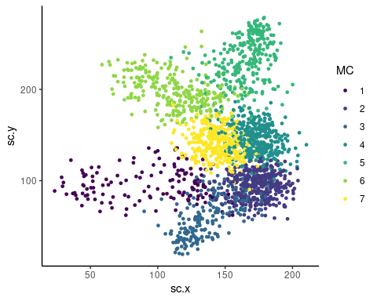
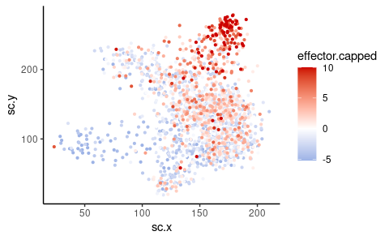
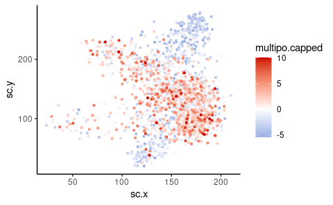
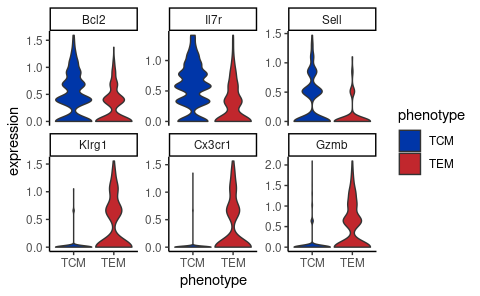
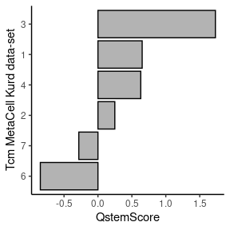
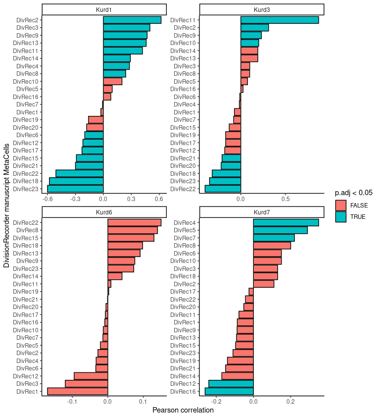
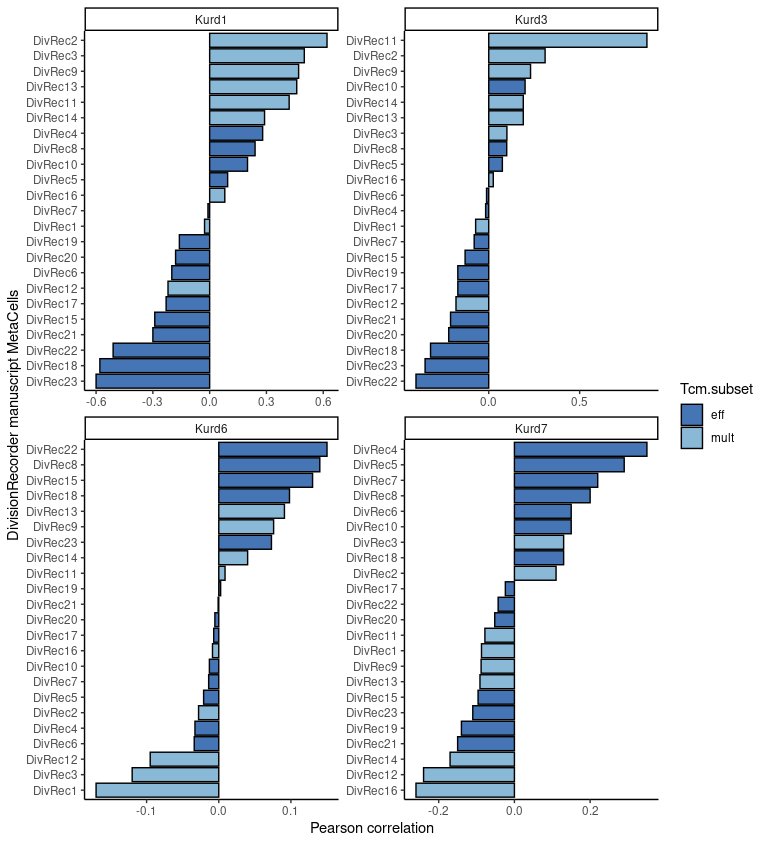

Re-analysis Kurd data
================
Kaspar Bresser
06/10/2021

-   [Identify subsets](#identify-subsets)
    -   [Process data](#process-data)
    -   [Visualize subsets](#visualize-subsets)
-   [Calculate QstemScore](#calculate-qstemscore)
-   [Calculate correlations](#calculate-correlations)

In the DivisionRecorder manuscript we performed a re-analysis of data
obtained by Kurd et al. (Science Immunology, 2020) in order to test if
‘replicative quiescent’ Tcm from an external data-set would resemble the
low-division Tcm in our data-set.

To test this we assessed Tcm clusters from the Kurd data for
enrichment/depletion of a ‘replicative quiescence’ associated gene
signature, and then calculated correlations between the most/least
quiescent from the Kurd data and all MetaCells from our data-set.

Load in packages used in the analysis, and import the data. We used the
metacell package to cluster the data obtained by Kurd et al. We’ll use

``` r
library(here)
library(metacell)
library(Seurat)
library(rstatix)
library(viridis)
library(scales)
library(tidytext)
library(tidyverse)


# point the metacell package to the data directory
scdb_init(here("Data"), force_reinit=T)

# import metacell objects
mc <- scdb_mc("D90_MC_col")
MC.graph <- scdb_mc2d("D90_MC_col")

# import UMI-count table from the Kurd data-set
UMI.counts <- read_tsv(here("Data", "Kurd_D90_counts.tsv"))
```

# Identify subsets

We want to do a focused analysis on Tcm, so we’ll roughly cluster the
memory T cell MetaCells from the Kurd data-set into Tem and Tcm.

## Process data

To do this we’ll get gene expression information from the UMI count
table, by first converting to a seurat object so we can use this package
for normalization. In the current table genes are stored as columns, the
`CreateSeuratObject` function takes a table in which cell-codes are
columns, and genes are rows.

``` r
UMI.counts %>% 
  column_to_rownames("cell_id") %>% 
  t() %>% 
  CreateSeuratObject() -> seurat.Kurd
```

    ## Warning: The following arguments are not used: row.names

    ## Warning: Feature names cannot have underscores ('_'), replacing with dashes
    ## ('-')

``` r
seurat.Kurd
```

    ## An object of class Seurat 
    ## 9941 features across 2000 samples within 1 assay 
    ## Active assay: RNA (9941 features, 0 variable features)

Normalize data using Seurats build-in method.

``` r
seurat.Kurd <- NormalizeData(seurat.Kurd, assay = "RNA", normalization.method = "CLR")
```

We’ll focus our analysis on a set of manually curated genes that relate
to immune function. Import the set.

``` r
immune.genes <- read_rds(here("Data", "imm_genes.rds"))

head(immune.genes, 20)
```

    ##  [1] "Ly96"    "Il1rl2"  "Il1rl1"  "Il18r1"  "Il18rap" "Cd28"    "Cxcr4"  
    ##  [8] "Cd55"    "Tnfsf4"  "Sell"    "Xcl1"    "Cd247"   "Cd244"   "Ly9"    
    ## [15] "Cd48"    "Cd84"    "Cd46"    "Il2ra"   "Il15ra"  "Cd302"

Next, extract the normalized UMI counts for these genes from the seurat
object.

``` r
seurat.Kurd %>% 
  GetAssayData( slot = "data", assay = "RNA")%>% 
  as.matrix() %>%
  t() %>% 
  as_tibble(rownames = "cellcode") %>% 
  select(any_of(c("cellcode", immune.genes)))-> expression.table
```

Get coordinates from the graph object and join with the expression data.

``` r
coords <- tibble( cellcode = names(MC.graph@sc_y),
                  sc.x = MC.graph@sc_x,
                  sc.y = MC.graph@sc_y)
coords
```

    ## # A tibble: 1,987 x 3
    ##    cellcode             sc.x  sc.y
    ##    <chr>               <dbl> <dbl>
    ##  1 TGACGGCCATATGCTG-24  45.2 105. 
    ##  2 AGATCTGTCTGTCTCG-24  64.8  75.8
    ##  3 AGGGATGCAGCCAATT-24  78.2  82.5
    ##  4 CGGACACCAGGAATCG-24  43.8 111. 
    ##  5 CTCGTCAAGTAGTGCG-24  47.8  84.3
    ##  6 CAACCTCGTTGGGACA-24  75.5  84.2
    ##  7 GGGCATCAGGGATGGG-24  54.8 109. 
    ##  8 GACTAACTCAGCTCTC-24  28.6 104. 
    ##  9 TGTGGTAGTACCGAGA-24  47.4  90.9
    ## 10 TCAGCAATCGGATGTT-24  66.8  82.1
    ## # … with 1,977 more rows

``` r
plot.data <- inner_join(coords, expression.table, by = "cellcode")
```

We’ll look at a small set of core effector and multipotency genes, so
lets define those.

``` r
eff.genes <-c("Tbx21", "Prdm1", "Id2", "Gzmb", "Klrg1", "Cx3cr1", "Prf1", "Lgals1","Ifng")
mult.genes <- c("Eomes", "Il7r","Sell", "Tcf7", "Bcl2", "Ccr7","Myb", "Bach2")
```

Finally we can add the summed effector and multipotency signature scores
to the table, did this by first scaling the genes within the signature,
and then summing those values, also capped at a certain maximum to
reduce the effect of outliers in visualization.

``` r
plot.data %>% 
  mutate(effector = rowSums( scale(select(., one_of(eff.genes))) ),
         effector.capped = case_when(effector > 10 ~ 10,
                                     TRUE ~ effector)) %>% 
  mutate(multipo = rowSums( scale(select(., one_of(mult.genes))) ),
         multipo.capped = case_when(multipo > 10 ~ 10,
                                     TRUE ~ multipo)) -> plot.data
```

## Visualize subsets

Lets first look at the MetaCell projection. Join the data with the
MetaCell identities and plot. Take the MetaCell identities from the `mc`
object.

``` r
enframe(as.factor(mc@mc), name = "cellcode", value = "MC") %>% 
  right_join(plot.data) %>% 
ggplot( aes(x=sc.x, y=sc.y, color = MC))+ 
  geom_point(size = 1)+
  theme_classic()+ 
  theme(legend.position = "right")+
  scale_color_viridis_d()
```



Next plot the effector signature

``` r
plot.data %>% 
  arrange(effector) %>% 
  ggplot( aes(x=sc.x, y=sc.y, color = effector.capped))+ 
  geom_point(size = 0.8)+
  scale_color_gradient2(low= "dodgerblue3", high= "red3", mid= "white", midpoint = 0)+
  theme_classic()
```



And same for the multipotency signature.

``` r
plot.data %>% 
  arrange(multipo) %>% 
  ggplot( aes(x=sc.x, y=sc.y, color = multipo.capped))+ 
  geom_point(size = 0.8)+
  scale_color_gradient2(low= "dodgerblue3", high= "red3", mid= "white", midpoint = 0)+
  theme_classic()
```



Based on these data we defined MC5 as a Tem cluster, and the remaining
MetaCells as Tcm clusters.

Lets have a look at the expression of some genes in these newly defined
subsets.

``` r
plot.genes <- c("Bcl2", "Il7r", "Sell", "Klrg1", "Cx3cr1", "Gzmb")
plot.data %>% 
  left_join(enframe(as.factor(mc@mc), "cellcode", "MC")) %>% 
  mutate(phenotype = case_when(MC == "5" ~ "TEM",
                               TRUE ~ "TCM")) %>% 
  select(one_of(c(plot.genes, "MC", "phenotype")) ) %>% 
  pivot_longer(cols = -c("MC", "phenotype"),  names_to = "gene", values_to = "expression") %>% 
  mutate(gene = factor(gene, plot.genes))  -> for.violins

for.violins
```

    ## # A tibble: 11,922 x 4
    ##    MC    phenotype gene   expression
    ##    <fct> <chr>     <fct>       <dbl>
    ##  1 1     TCM       Bcl2        0.903
    ##  2 1     TCM       Il7r        0.774
    ##  3 1     TCM       Sell        0    
    ##  4 1     TCM       Klrg1       0    
    ##  5 1     TCM       Cx3cr1      0    
    ##  6 1     TCM       Gzmb        0    
    ##  7 1     TCM       Bcl2        0.682
    ##  8 1     TCM       Il7r        0    
    ##  9 1     TCM       Sell        0    
    ## 10 1     TCM       Klrg1       0    
    ## # … with 11,912 more rows

``` r
ggplot(for.violins, aes(x = phenotype, y = expression, fill = phenotype))+
  geom_violin(scale = "width")+
  facet_wrap(~gene, scales = "free_y", nrow = 2)+
  scale_fill_manual(values = c("#0036A8","#C1272D"))
```



# Calculate QstemScore

Next we’ll zoom in on the Tcm MetaCells of the Kurd data-set and
calculate the relative expression of genes associated wiht replicative
quiescence in stem cell, or QstemScore as we refer to it in the
manuscript.

The signature consists of genes negatively or positively associated with
stem cell quiescence. Lets read in both.

``` r
gs.neg <- read_lines(here("Data", "Quiescence_neg_sig.txt"))
gs.pos <- read_lines(here("Data", "Quiescence_pos_sig.txt"))
```

We’ll calculate a positive and a negative score, using the
gene-enrichment values that are stored in the `mc` object.

``` r
lfp <- log2(mc@mc_fp)


lfp %>% 
  as_tibble(rownames = "genes") %>% 
  filter(genes %in% c(gs.pos, gs.neg)) %>% 
  pivot_longer(cols = -c(genes), names_to = "MC", values_to = "lfp") %>% 
  mutate(direction = case_when(genes %in% gs.pos ~ "positive",
                               genes %in% gs.neg ~ "negative")) %>% 
  group_by(MC, direction) %>% 
  summarise(score = sum(lfp)) -> QstemScores
```

Then calculate a complete QstemScore by subtracting the negative score
from the positive score

``` r
QstemScores %>% 
  pivot_wider(names_from = "direction", values_from = "score") %>% 
  group_by(MC) %>% 
  summarise(score = positive - negative ) -> QstemScores

QstemScores
```

    ## # A tibble: 7 x 2
    ##   MC     score
    ##   <chr>  <dbl>
    ## 1 1      0.652
    ## 2 2      0.249
    ## 3 3      1.73 
    ## 4 4      0.631
    ## 5 5      0.348
    ## 6 6     -0.849
    ## 7 7     -0.282

Now to visualize. Also, drop MC5 (the Tem MetaCell).

``` r
QstemScores %>% 
  filter(!(MC == 5)) %>% 
  mutate(MC = fct_reorder(MC, score)) %>% 
  ggplot(aes(MC, score))+
    geom_bar(stat = "identity", fill = "grey70", color = "black")+
    coord_flip()+
    theme_classic()+
    scale_y_continuous(breaks = breaks_width(0.5))+
    labs(x = "Tcm MetaCell Kurd data-set", y = "QstemScore")
```



# Calculate correlations

In the above analysis we found that MC3 and MC1 had the highest
QstemScore, and MC6 and MC7 had the lowest. We’ll check how well these
MCs correlate, in terms of gene-expression of immune related genes, to
the MCs found in our data-set.

Import the mc object from the DivisionRecorder manuscript and extract
the gene-enrichment values.

``` r
mc.DivRec <- scdb_mc("DivRecMEM_MC")

lfp.DivRec <- log2(mc.DivRec@mc_fp)
```

We’ll focus on immune related genes, that we have data on in both
data-sets.

``` r
focus.genes <- intersect(row.names(lfp),row.names(lfp.DivRec))
focus.genes <- intersect(focus.genes, immune.genes)
```

Convert both tables to tibbles

``` r
lfp <- as_tibble(lfp, rownames = "genes")
lfp.DivRec <- as_tibble(lfp.DivRec, rownames = "genes")
```

Join the tibbles, first select the MetaCells from the Kurd data that
we’re interested in, then join wiht the DivisionRecorder data. Also,
rename both sets.

``` r
lfp %>% 
  select(one_of( c("genes", "1", "3", "6", "7"))) %>% 
  rename_with( ~paste0("Kurd", .), where(is_numeric) ) %>% 
  inner_join(lfp.DivRec) %>% 
  rename_with( ~paste0("DivRec", .), all_of(as.character(1:23)) ) -> combined.data

combined.data
```

    ## # A tibble: 9,003 x 28
    ##    genes      Kurd1    Kurd3    Kurd6   Kurd7  DivRec1  DivRec2 DivRec3  DivRec4
    ##    <chr>      <dbl>    <dbl>    <dbl>   <dbl>    <dbl>    <dbl>   <dbl>    <dbl>
    ##  1 Mrpl15  -1.19e-1 -0.0385   0.0256   0      -0.0804   0.0495  -0.0284  0.0863 
    ##  2 Lypla1  -1.49e-2 -0.0383   0.0102   0      -0.0345  -0.0189  -0.0193 -0.0255 
    ##  3 Tcea1    2.82e-2 -0.0409  -0.0570  -0.0367 -0.0467  -0.0407  -0.0781 -0.0418 
    ##  4 Atp6v1h -2.72e-2  0.0954   0.0579  -0.0356 -0.0388  -0.0479  -0.0412 -0.0434 
    ##  5 Rb1cc1  -2.36e-2  0.153    0       -0.0419  0.0133  -0.0498  -0.0275 -0.196  
    ##  6 Pcmtd1  -1.20e-1 -0.0607   0.0429  -0.0520  0.00514 -0.00347 -0.0131 -0.159  
    ##  7 Rrs1     9.52e-2 -0.0857   0.00599 -0.0173 -0.0827   0.0464  -0.0584  0.0541 
    ##  8 Vcpip1   8.78e-2 -0.00701 -0.0341   0.0141 -0.0582   0.0120  -0.0292 -0.0965 
    ##  9 Sgk3    -4.38e-4  0.0295   0.0220   0.0214 -0.0164   0.0229   0      -0.00192
    ## 10 Snhg6    0       -0.132   -0.0327   0.0586  0.0691   0.0616   0.0786  0.0640 
    ## # … with 8,993 more rows, and 19 more variables: DivRec5 <dbl>, DivRec6 <dbl>,
    ## #   DivRec7 <dbl>, DivRec8 <dbl>, DivRec9 <dbl>, DivRec10 <dbl>,
    ## #   DivRec11 <dbl>, DivRec12 <dbl>, DivRec13 <dbl>, DivRec14 <dbl>,
    ## #   DivRec15 <dbl>, DivRec16 <dbl>, DivRec17 <dbl>, DivRec18 <dbl>,
    ## #   DivRec19 <dbl>, DivRec20 <dbl>, DivRec21 <dbl>, DivRec22 <dbl>,
    ## #   DivRec23 <dbl>

Now calculate the correlations between Kurd MetaCells and the DivRec
MetaCells, focusing on our selected genes. `rstatix::cor_test()` has a
nice implementation to compare specific columns with each other using
`tidyselect` verbs.

``` r
combined.data %>% 
  filter(genes %in% focus.genes) %>% 
  cor_test(vars = contains("Kurd"), vars2 =  contains("DivRec"), method = "pearson") %>% 
  adjust_pvalue(p.col = "p", output.col = "p.adj", method = "bonferroni") -> correlations

correlations
```

    ## # A tibble: 92 x 9
    ##    var1  var2        cor statistic        p conf.low conf.high method     p.adj
    ##    <chr> <chr>     <dbl>     <dbl>    <dbl>    <dbl>     <dbl> <chr>      <dbl>
    ##  1 Kurd1 DivRec1  -0.027    -0.460 6.46e- 1  -0.140     0.0871 Pearson 1   e+ 0
    ##  2 Kurd1 DivRec2   0.62     13.5   1.21e-32   0.541     0.683  Pearson 1.11e-30
    ##  3 Kurd1 DivRec3   0.5       9.94  2.83e-20   0.410     0.581  Pearson 2.60e-18
    ##  4 Kurd1 DivRec4   0.28      5.06  7.34e- 7   0.174     0.384  Pearson 6.75e- 5
    ##  5 Kurd1 DivRec5   0.095     1.63  1.03e- 1  -0.0193    0.206  Pearson 1   e+ 0
    ##  6 Kurd1 DivRec6  -0.2      -3.54  4.67e- 4  -0.308    -0.0899 Pearson 4.30e- 2
    ##  7 Kurd1 DivRec7  -0.009    -0.154 8.77e- 1  -0.122     0.105  Pearson 1   e+ 0
    ##  8 Kurd1 DivRec8   0.24      4.16  4.14e- 5   0.125     0.340  Pearson 3.81e- 3
    ##  9 Kurd1 DivRec9   0.47      9.12  1.21e-17   0.375     0.552  Pearson 1.11e-15
    ## 10 Kurd1 DivRec10  0.2       3.44  6.71e- 4   0.0842    0.303  Pearson 6.17e- 2
    ## # … with 82 more rows

And finally plot the correlations. Lets highlight the significant
correlations.

``` r
correlations %>% 
  mutate(var2 = reorder_within(var2, cor, var1)) %>% 
  ggplot(aes(var2, cor, fill = p.adj < 0.05))+
    geom_bar(stat = "identity", color = "black")+
    facet_wrap(~var1, scales = "free")+
    coord_flip()+
    scale_x_reordered()+
    theme_classic()+
    labs(x = "DivisionRecorder manuscript MetaCells", y = "Pearson correlation")
```



And plot again, but this time color by multipotent or effector-like Tcm.

``` r
Tcm.mult <- paste0("DivRec", c('9','1','12','13','14','16','11','2','3'))

correlations %>% 
  mutate(Tcm.subset = case_when(var2 %in% Tcm.mult ~ "mult",
                                TRUE ~ "eff"),
         var2 = reorder_within(var2, cor, var1)) %>% 
  ggplot(aes(var2, cor, fill =Tcm.subset))+
  geom_bar(stat = "identity", color = "black")+
  facet_wrap(~var1, scales = "free")+
  coord_flip()+
  scale_x_reordered()+
  scale_fill_manual(values = c("#4575B4" ,"#8AB8D7"))+
  theme_classic()+
  labs(x = "DivisionRecorder manuscript MetaCells", y = "Pearson correlation")
```


