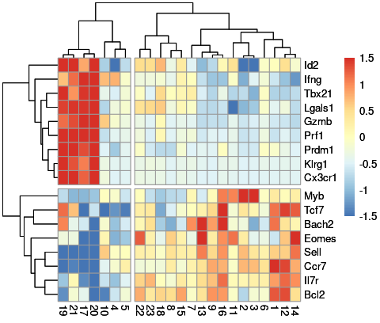
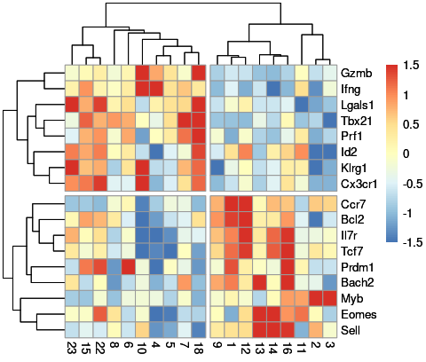

Subgrouping memory T cells
================
Kaspar Bresser
31/08/2021

-   [Load packages and data](#load-packages-and-data)
-   [Define and visualize Tcm/Tem
    subsets](#define-and-visualize-tcmtem-subsets)
    -   [Get normalized UMI counts](#get-normalized-umi-counts)
    -   [Prep for plotting](#prep-for-plotting)
    -   [Highlight eff/mult genes](#highlight-effmult-genes)
    -   [Subsetting for Tcm and Tem](#subsetting-for-tcm-and-tem)
-   [Define and visualize Tcm
    sub-clusters](#define-and-visualize-tcm-sub-clusters)
    -   [Get gene-enrichment values](#get-gene-enrichment-values)
    -   [Heatmap (with Tem)](#heatmap-with-tem)
    -   [Heatmap (without Tem)](#heatmap-without-tem)
    -   [Boxplots marker genes](#boxplots-marker-genes)

# Load packages and data

In the DivisionRecorder manuscript we roughly cluster the identified
memory T cell MetaCells into multipotent, effector-like and terminally
differentiated cells. Below are the analysis performed to obtain the
figures presented that support this clustering.

Start off with loading in the required packages and the data used in the
analysis.

We’ll need the metacell object (containing cellcode-MC pairs, plus
gene-enrichment values), the seurat object (containing all UMI count
data), and the mc2d object (the 2d projection generated by the metacell
algorithm).

``` r
library(here)
library(tidyverse)
library(metacell)
library(Seurat)
library(pheatmap)
library(rstatix)
library(ggpubr)
library(viridis)
library(RColorBrewer)

# point the metacell package to the data directory
scdb_init(here("Data"), force_reinit=T)

# import metacell objects
mc <- scdb_mc("DivRecMEM_MC")
MC.graph <- scdb_mc2d("DivRecMEM_MC")

# import seurat object
memory.seurat <- read_rds(here("Data", "seurat_object_all_exps.rds"))
```

# Define and visualize Tcm/Tem subsets

## Get normalized UMI counts

The data was obtained in two different experiments. We’ll subset the
seurat object by experiment in order to normalize within each
experiment.

``` r
memory.seurat@meta.data %>% 
  filter(experiment %in% c("Mem.exp.2.1", "Mem.exp.2.2")) %>% 
  rownames -> exp2.cells
memory.seurat@meta.data %>% 
  filter(experiment %in% c( "Mem.exp.1")) %>% 
  rownames -> exp1.cells

UMI.data.1 <- subset(memory.seurat, cells = exp1.cells)
UMI.data.2 <- subset(memory.seurat, cells = exp2.cells)
```

Now we can normalize and scale the UMI counts using the build in Seurat
functions

``` r
UMI.data.2 <- NormalizeData(UMI.data.2, assay = "RNA", normalization.method = "CLR")
UMI.data.1 <- NormalizeData(UMI.data.1, assay = "RNA", normalization.method = "CLR")
```

Extract normalized UMI counts, tidy, and combine experiments.

``` r
UMI.data.2 %>% 
  GetAssayData( slot = "data", assay = "RNA")%>% 
  as.matrix %>%
  t %>% 
  as.data.frame %>% 
  rownames_to_column("cellcode") %>% 
  as_tibble -> UMI.data.2
UMI.data.1 %>% 
  GetAssayData( slot = "data", assay = "RNA")%>% 
  as.matrix %>%
  t %>% 
  as.data.frame %>% 
  rownames_to_column("cellcode") %>% 
  as_tibble -> UMI.data.1

UMI.data.1 %>% 
  bind_rows(UMI.data.2) -> all.UMI.counts
all.UMI.counts
```

    ## # A tibble: 39,551 × 31,054
    ##    cellcode  Xkr4 Gm1992 Gm37381   Rp1 Sox17 Gm37323 Mrpl15 Lypla1 Gm37988 Tcea1
    ##    <chr>    <dbl>  <dbl>   <dbl> <dbl> <dbl>   <dbl>  <dbl>  <dbl>   <dbl> <dbl>
    ##  1 AAACCCA…     0      0       0     0     0       0  0.867  0.598       0 0.531
    ##  2 AAACCCA…     0      0       0     0     0       0  0      0           0 0.876
    ##  3 AAACCCA…     0      0       0     0     0       0  0.525  0           0 0.531
    ##  4 AAACCCA…     0      0       0     0     0       0  0.525  0.598       0 0    
    ##  5 AAACGAA…     0      0       0     0     0       0  0      0           0 0    
    ##  6 AAACGAA…     0      0       0     0     0       0  0      0           0 0    
    ##  7 AAACGCT…     0      0       0     0     0       0  0.525  0           0 0    
    ##  8 AAAGAAC…     0      0       0     0     0       0  0      0           0 1.34 
    ##  9 AAAGGAT…     0      0       0     0     0       0  0      0           0 0.531
    ## 10 AAAGGGC…     0      0       0     0     0       0  0.525  0           0 0    
    ## # … with 39,541 more rows, and 31,043 more variables: Rgs20 <dbl>,
    ## #   Gm16041 <dbl>, Atp6v1h <dbl>, Oprk1 <dbl>, Npbwr1 <dbl>, Rb1cc1 <dbl>,
    ## #   4732440D04Rik <dbl>, Alkal1 <dbl>, St18 <dbl>, Pcmtd1 <dbl>, Gm26901 <dbl>,
    ## #   Gm30414 <dbl>, Sntg1 <dbl>, Rrs1 <dbl>, Adhfe1 <dbl>, 3110035E14Rik <dbl>,
    ## #   Gm29520 <dbl>, Mybl1 <dbl>, Vcpip1 <dbl>, 1700034P13Rik <dbl>, Sgk3 <dbl>,
    ## #   Mcmdc2 <dbl>, Snhg6 <dbl>, Tcf24 <dbl>, Ppp1r42 <dbl>, Gm15818 <dbl>,
    ## #   Cops5 <dbl>, Cspp1 <dbl>, Arfgef1 <dbl>, Cpa6 <dbl>, Prex2 <dbl>, …

## Prep for plotting

Next we’ll select just the genes we need for plotting the signatures
we’re interested in and add the 2D projection info.

In the manuscript we focus on two small signatures, representing key
multipotency- or effector-associated genes.

``` r
eff.genes <-c("Tbx21", "Prdm1", "Id2", "Gzmb", "Klrg1", "Cx3cr1", "Prf1", "Lgals1","Ifng")
mult.genes <- c("Eomes", "Il7r","Sell", "Tcf7", "Bcl2", "Ccr7","Myb", "Bach2")
```

Get the coordinates from the 2D object, store as tibble.

``` r
coords <- tibble( cellcode = names(MC.graph@sc_y),
                  sc.x = MC.graph@sc_x,
                  sc.y = MC.graph@sc_y)
coords
```

    ## # A tibble: 27,559 × 3
    ##    cellcode              sc.x  sc.y
    ##    <chr>                <dbl> <dbl>
    ##  1 AAACCCACAACACGTT-1_1 277.   237.
    ##  2 AAACCCACAATTTCTC-1_1 234.   311.
    ##  3 AAACCCACACTCAAGT-1_1 247.   296.
    ##  4 AAACCCAGTGCTCGTG-1_1 254.   311.
    ##  5 AAACGAAAGAAGAGCA-1_1 315.   166.
    ##  6 AAACGAAAGTCGGCCT-1_1 241.   307.
    ##  7 AAACGAACACCTGCTT-1_1 238.   301.
    ##  8 AAACGAACAGCCGTCA-1_1  38.0  291.
    ##  9 AAACGAAGTCACTACA-1_1 211.   327.
    ## 10 AAACGAAGTGCTATTG-1_1 310.   292.
    ## # … with 27,549 more rows

Now subset the UMI count table and combine with coordinates.

``` r
all.UMI.counts %>% 
  dplyr::select(one_of("cellcode", eff.genes, mult.genes)) %>% 
  right_join(coords, scaled.data, by = "cellcode") %>% 
  na.omit() -> all.UMI.counts
```

## Highlight eff/mult genes

First we’ll have a look at scatter plot 2d projection of all the
MetaCells. Join the location information with the MC-ids and make a
scatter plot

``` r
enframe(as.factor(mc@mc), name = "cellcode", value = "MC") %>% 
  right_join(all.UMI.counts) %>% 
ggplot( aes(x=sc.x, y=sc.y, color = MC))+ 
  geom_point(size = 0.5)+
  theme_classic()+ 
  theme(legend.position = "right")+
  scale_color_viridis_d()
```


``` r
ggsave(filename = here("Figs", "2d_proj_MCs.pdf"), device = "pdf", width = 5.2,height = 4)
```

Now lets look at the effector and multipotency signatures highlighted on
top of the metacell projection. Starting off with the effector
signature.

``` r
all.UMI.counts %>% 
  mutate(effector = rowSums( scale(select(.,one_of(eff.genes))) )) %>% 
  mutate(effector.capped = case_when(effector > 10 ~ 10,
                                     TRUE ~ effector)) -> all.UMI.counts

## Plot effector signature
all.UMI.counts %>% 
#  sample_n(nrow(.))%>%
  arrange(effector) %>% 
  ggplot( aes(x=sc.x, y=sc.y, color = effector.capped))+ 
  geom_point(size = 0.2)+
  scale_color_gradient2(low= "dodgerblue3", high= "red3", mid= "white", midpoint =0)+
  theme_classic()
```


``` r
ggsave(filename = here( "Figs","effector_sig.pdf"), device = "pdf", width = 4,height = 3)
```

And the same for the multipotency signature!

``` r
all.UMI.counts %>% 
  mutate(multipo = rowSums( scale(select(.,one_of(mult.genes))) )) %>% 
  mutate(multipo.capped = case_when(multipo > 10 ~ 10,
                                     TRUE ~ multipo)) -> all.UMI.counts

## Plot effector signature
all.UMI.counts %>% 
#  sample_n(nrow(.))%>%
  arrange(multipo) %>% 
  ggplot( aes(x=sc.x, y=sc.y, color = multipo.capped))+ 
  geom_point(size = 0.2)+
  scale_color_gradient2(low= "dodgerblue3", high= "red3", mid= "white", midpoint =0)+
  theme_classic()
```


``` r
ggsave(filename = here( "Figs","multipo_sig.pdf"), device = "pdf", width = 4,height = 3)
```

## Subsetting for Tcm and Tem

Look at the same 2d plot, but now show Tem, Tcm identities based on
transcriptome. This selection was made guided by the signature
expression as seen above. There we found that MC17, 19, 20 and 21 appear
to be effector memory cells.

Will add this distinction as a column, and make the plot.

``` r
enframe(as.factor(mc@mc), name = "cellcode", value = "MC") %>% 
  right_join(all.UMI.counts) %>% 
  mutate(phenotype = case_when(MC %in% c('21','19','17','20') ~ "Tem",
                               TRUE ~ "Tcm") ) %>% 
ggplot( aes(x=sc.x, y=sc.y, color = phenotype))+ 
  geom_point(size = 0.5)+
  theme_classic()+ 
  theme(legend.position = "right")+
  scale_color_manual(values = c("#0036A8","#C1272D"))
```


``` r
ggsave(filename = here( "Figs","2d_proj_phenotype.pdf"), device = "pdf", width = 4,height = 3)
```

To check if our subdivision was sensible, lets plot the expression of
the signatures, and some marker genes as violins.

Prep the data, pivot to longer data, and clean up a bit. Removed the
super high signature scores, for visualization.

``` r
to.plot <- c("Bcl2", "Il7r", "Sell", "multipo", "Klrg1", "Cx3cr1", "Gzmb", "effector")

enframe(as.factor(mc@mc), name = "cellcode", value = "MC") %>% 
  right_join(all.UMI.counts) %>% 
  mutate(phenotype = case_when(MC %in% c('21','19','17','20') ~ "Tem",
                               TRUE ~ "Tcm") ) %>% 
  select(one_of(c(to.plot, "MC", "phenotype")) ) %>% 
  pivot_longer(cols = one_of(c(to.plot, "multipo", "effector")), names_to =  "gene", values_to = "expression") %>% 
  mutate(gene = factor(gene, to.plot)) %>% 
  na.omit() %>% 
  filter(expression < 20)-> for.violins
for.violins
```

    ## # A tibble: 220,426 × 4
    ##    MC    phenotype gene     expression
    ##    <fct> <chr>     <fct>         <dbl>
    ##  1 14    Tcm       Bcl2          1.77 
    ##  2 14    Tcm       Il7r          0.888
    ##  3 14    Tcm       Sell          0.470
    ##  4 14    Tcm       multipo       6.45 
    ##  5 14    Tcm       Klrg1         0    
    ##  6 14    Tcm       Cx3cr1        0    
    ##  7 14    Tcm       Gzmb          0    
    ##  8 14    Tcm       effector      1.81 
    ##  9 16    Tcm       Bcl2          1.39 
    ## 10 16    Tcm       Il7r          0.821
    ## # … with 220,416 more rows

Now we can use that table to generate some violins

``` r
ggplot(for.violins, aes(x = phenotype, y = expression, fill = phenotype))+
  geom_violin(scale = "width")+
  facet_wrap(~gene, scales = "free_y", nrow = 2)+
  scale_fill_manual(values = c("#0036A8","#C1272D"))
```


``` r
ggsave(here("Figs", "Violins_Tcm_Tem.pdf"), width = 5, height = 2.5)
```

# Define and visualize Tcm sub-clusters

## Get gene-enrichment values

Using the enrichment values of genes across MetaCells, we identified a
sub-clustering within Tcm that could be identified as more effector-like
and more multipotent-like Tcm.

Below are the analysis performed to produce the figures depicted in the
manuscript.

We’ll be using the gene-enrichment values of the MetaCells, calculated
using the metacell package, to look at enrichments and/or depletion of
expression of genes of interest. Start off with extracting that
information from the metacell object.

``` r
lfp <- log2(mc@mc_fp)

dim(lfp)
```

    ## [1] 13349    23

For visualizing the data in the form of a heatmap we’ll use the genes
from our multipotency and effector signatures that we used above. Also,
transform to a matrix, as that is the input for the `pheatmap` function.

``` r
to.plot <- as.matrix(lfp[c(eff.genes, mult.genes),])

dim(to.plot)
```

    ## [1] 17 23

``` r
to.plot %>% 
  as.data.frame() %>% 
  write_tsv(here("Output", "Fig_4b.tsv"))
```

## Heatmap (with Tem)

``` r
hm <- pheatmap(mat = to.plot,  scale = "row", clustering_distance_rows = "euclidean",
         clustering_distance_cols = "correlation", breaks = seq(-1.5,1.5,by=0.03),
         color = colorRampPalette(rev(brewer.pal(n = 7, name ="RdYlBu")))(100), cutree_rows = 2, cutree_cols = 2)

hm
```



``` r
pdf(here("Figs", "heatmap_eff_vs_multWterm.pdf"), height = 5, width = 10)
hm
dev.off()
```

    ## png 
    ##   2

## Heatmap (without Tem)

``` r
to.plot <- to.plot[,-c(17,19,20,21)]
hm <- pheatmap(mat = to.plot,  scale = "row", clustering_distance_rows = "euclidean",
         clustering_distance_cols = "correlation", breaks = seq(-1.5,1.5,by=0.03),
         color = colorRampPalette(rev(brewer.pal(n = 7, name ="RdYlBu")))(100), cutree_rows = 2, cutree_cols = 2)

hm
```



``` r
pdf(here("Figs", "heatmap_eff_vs_multWterm.pdf"), height = 5, width = 10)
hm
dev.off()
```

    ## png 
    ##   2

## Boxplots marker genes

We’ll make some boxplots to visualize the expression of some key genes
in each defined cluster. First we’ll prep the enrichment-values and
tidy, so the selected genes are mapped to a specific column.

``` r
select.genes <- c("Klrg1", "Cx3cr1", "Gzma", "Zeb2" , "Prdm1", "Tbx21", "Bcl2", "Cd27", "Xcl1", "Ccr7", "Il7r", "Sell")

as.data.frame(lfp) %>% 
  rownames_to_column("genes") %>% 
  as_tibble() %>% 
  dplyr::filter(genes %in% select.genes) %>% 
  mutate(genes = factor(genes, levels = select.genes)) %>% 
  pivot_longer(cols = -genes, names_to = "metacell", values_to =  "lfp") %>% 
  mutate(cluster = factor(fct_collapse(.$metacell,
                                       eff = c('23','15','22','8','6','10','4','5','7','18'),
                                       mult = c('9','1','12','13','14','16','11','2','3'),
                                       term = c('21','19','17','20')), 
                          levels = c("term", "eff", "mult")  ) ) -> to.plot
to.plot
```

    ## # A tibble: 276 × 4
    ##    genes metacell     lfp cluster
    ##    <fct> <chr>      <dbl> <fct>  
    ##  1 Bcl2  1         0.290  mult   
    ##  2 Bcl2  2        -0.152  mult   
    ##  3 Bcl2  3        -0.0192 mult   
    ##  4 Bcl2  4        -0.117  eff    
    ##  5 Bcl2  5        -0.0272 eff    
    ##  6 Bcl2  6        -0.0106 eff    
    ##  7 Bcl2  7         0      eff    
    ##  8 Bcl2  8         0.121  eff    
    ##  9 Bcl2  9         0.218  mult   
    ## 10 Bcl2  10       -0.287  eff    
    ## # … with 266 more rows

``` r
write_tsv(to.plot, here("Output", "Fig_4c.tsv"))
```

Next, calculate some statistics using the `rstatix` package.

``` r
to.plot %>%
  group_by(genes) %>%
  tukey_hsd(lfp ~ cluster)%>%
  add_y_position(scales = "free_y", fun = "max", step.increase = 0.2) -> stat.test
stat.test
```

    ## # A tibble: 36 × 12
    ##    genes  term    group1 group2 null.value estimate conf.low conf.high    p.adj
    ##    <fct>  <chr>   <chr>  <chr>       <dbl>    <dbl>    <dbl>     <dbl>    <dbl>
    ##  1 Klrg1  cluster term   eff             0  -0.872    -1.13     -0.613 1.33e- 7
    ##  2 Klrg1  cluster term   mult            0  -0.899    -1.16     -0.635 1.06e- 7
    ##  3 Klrg1  cluster eff    mult            0  -0.0264   -0.228     0.175 9.41e- 1
    ##  4 Cx3cr1 cluster term   eff             0  -1.34     -1.62     -1.06  3.44e-10
    ##  5 Cx3cr1 cluster term   mult            0  -1.38     -1.67     -1.10  2.68e-10
    ##  6 Cx3cr1 cluster eff    mult            0  -0.0404   -0.258     0.177 8.86e- 1
    ##  7 Gzma   cluster term   eff             0  -1.01     -1.66     -0.356 2.4 e- 3
    ##  8 Gzma   cluster term   mult            0  -1.02     -1.69     -0.360 2.43e- 3
    ##  9 Gzma   cluster eff    mult            0  -0.0146   -0.521     0.492 9.97e- 1
    ## 10 Zeb2   cluster term   eff             0  -2.42     -2.80     -2.04  2.04e-12
    ## # … with 26 more rows, and 3 more variables: p.adj.signif <chr>,
    ## #   y.position <dbl>, groups <named list>

And finally, plot the data as boxplots. Used the `stat_pvalue_manual`
function from `ggpubr` to add P values to the plot.

``` r
ggplot(to.plot, aes(x = cluster, y = lfp, color = cluster ))+
  geom_boxplot(outlier.shape = NA)+
  scale_color_manual(values = c("#C1272D","#4575B4" ,"#8AB8D7"))+
  geom_jitter(color = "black", width = .2, size = .8)+
  facet_wrap(~genes, scales = "free", nrow = 2)+
  stat_pvalue_manual(data = stat.test, label = "p.adj", label.size = 3, hide.ns = T, tip.length = 0.02) +
  scale_y_continuous(expand = expansion(mult = c(0.05, 0.1)))+
  theme(strip.background = element_blank())
```


``` r
ggsave( here("Figs","boxplots_lfp.pdf"), device = "pdf", width = 8, height = 4)
```
