Comparison of low-division and high-division Tcm
================
Kaspar Bresser
29/07/2021

-   [First glimpse of marker genes](#first-glimpse-of-marker-genes)
    -   [Set immunne-gene list](#set-immunne-gene-list)
    -   [Waterfalls marker genes](#waterfalls-marker-genes)
    -   [Heatmaps gene-groups](#heatmaps-gene-groups)
        -   [Multipotency-related](#multipotency-related)
        -   [Survival-related](#survival-related)
        -   [Cytotoxicity-related](#cytotoxicity-related)
        -   [Inhibitory-related](#inhibitory-related)
-   [DGE analysis](#dge-analysis)
    -   [Differential expression
        testing](#differential-expression-testing)
    -   [Volcano plot](#volcano-plot)
    -   [Heatmaps Immune-genes](#heatmaps-immune-genes)
        -   [Upregulated ld-Tcm](#upregulated-ld-tcm)
        -   [Upregulated hd-Tcm](#upregulated-hd-tcm)
    -   [Gene-set enrichment analysis](#gene-set-enrichment-analysis)
-   [Quiescence of ld-Tcm](#quiescence-of-ld-tcm)
    -   [GSEA on hallmark sigs](#gsea-on-hallmark-sigs)
    -   [Quiescence scores](#quiescence-scores)

Having identified low-division and high-division MetaCells in the
scRNAseq dataset, we used these identifiers to look into transcriptional
differences linked to division history

We’ll be doing a whole bunch of analysis and visualizations, lets import
all packages needed to facilitate this.

Import the mat (containing all cell-metadata) and mc (containing
cellcode-MC pairs, plus gene-enrichment values) objects.

``` r
library(here)
library(tidyverse)
library(metacell)
library(Seurat)
library(rstatix)
library(tidytext)
library(limma)
library(ggrepel)
library(gghighlight)
library(pheatmap)
library(fgsea)
library(msigdbr)
library(ggpubr)

# point the metacell package to the data directory
scdb_init(here("Data"), force_reinit=T)

# import metacell objects
mc <- scdb_mc("DivRecMEM_MC")
clean.mat <- scdb_mat("DivRecMEM_clean")

lfp <- log2(mc@mc_fp)
```

# First glimpse of marker genes

## Set immunne-gene list

For some of the analysis we focused specifically on genes that are
known, or likely, to have a function in immune regulation. The list was
compiled mostly from databases such as GO and KEGG, and finalized
manually. The list is by no means exhaustive or absolute, but allows us
to focus a bit more on familiar genes and networks, nicely supplementing
the unbiased analysis.

Made use of a series of regular expressions to extract genes from the
lfp object

``` r
T.cell.marks <- grep(pattern = "Sell$|Ltb|Tox|Ccr\\d+$|Cxcr\\d+$|Cd\\d+|Xcl1|Ifng|Prf1|Gzm|^Il\\d+|^Il\\d+r|Tnf|^Jak\\d+$|Itg|Ly\\d+|Tlr\\d+|Klr", 
                     x = row.names(lfp), value = T)
more <- grep(pattern = "Havcr2|Lag3|Cx3cr1|Pdcd1|^Nr4a|Ctla|Havcr2|Serpin|P2rx|Traf\\d+$|Gimap|Bcl\\d+|Lgals\\d+$|Bcl2|Cd\\d+$|Fbxo\\d+$|Lat$|Kdelr|Prr7|Tgf|Fas$|Fasl$|S100a|Clec", 
             x = row.names(lfp), value = T)
TF <- grep(pattern = "Id\\d+|Tcf\\d+|Foxo\\d+|Dnmt1|Ezh2|Bach2|Myb|Zeb\\d+|Prdm\\d+$|Klf\\d+|Sox\\d+$|Cd\\d+$|Foxp\\d+|Gata\\d+|Socs\\d+|^Stat\\d+$|Eomes|Tbx21|Icos|Jun|Runx", 
           x = row.names(lfp), value = T)
add <- grep(pattern = "S1pr|^Jak|^Tlr", 
            x = row.names(lfp), value = T)
imm.genes <- unique(c(T.cell.marks, more, TF, add))

head(imm.genes, 25)
```

    ##  [1] "Ly96"    "Il1rl2"  "Il1rl1"  "Il18r1"  "Il18rap" "Cd28"    "Cxcr4"  
    ##  [8] "Cd55"    "Tnfsf4"  "Sell"    "Xcl1"    "Cd247"   "Cd244"   "Ly9"    
    ## [15] "Cd48"    "Cd84"    "Cd46"    "Il2ra"   "Il15ra"  "Cd302"   "Ly75"   
    ## [22] "Itga6"   "Itga4"   "Itgav"   "Cd82"

``` r
write_rds(imm.genes, here("Output", "imm_genes.rds"))
```

## Waterfalls marker genes

Using the immune gene list, we can have a look at the marker genes in
each low-division and high-division MetaCell.

We’ll prep the data a bit, taking the lfp dataframe (genes are rows,
MetaCells are columns) and selecting the ld-Tcm (2, 11, 14) and hd-Tcm
(6, 8, 18) MetaCells, filtering for immune genes. Then pivot to long
format, and set the factor levels of the MC variable to the order that
we’d like to use for plotting later.

``` r
as.data.frame(lfp) %>% 
  select(one_of(c('2','11','14', '6','8','18'))) %>% 
  rownames_to_column("genes") %>%
  filter(genes %in% imm.genes) %>% 
  pivot_longer(cols = -genes, names_to = "MC", values_to =  "lfp") %>%
  mutate(MC = factor(MC, levels =c('2','11','14', '6','8','18'))) -> filtered.lfp

filtered.lfp
```

    ## # A tibble: 2,604 x 3
    ##    genes MC         lfp
    ##    <chr> <fct>    <dbl>
    ##  1 Mybl1 2      0.00377
    ##  2 Mybl1 11    -0.00205
    ##  3 Mybl1 14     0      
    ##  4 Mybl1 6     -0.00447
    ##  5 Mybl1 8      0.00225
    ##  6 Mybl1 18     0.00549
    ##  7 Ly96  2     -0.00289
    ##  8 Ly96  11     0.00656
    ##  9 Ly96  14    -0.00483
    ## 10 Ly96  6     -0.00417
    ## # … with 2,594 more rows

For the plot we’ll show the top and bottom 5 genes of each MC. We can
filter on those using the `dplyr::dense_rank`.

Finally, used `tidytext::reorder_within` to properly order the gene
factor-levels by enrichment-value within each MetaCell.

``` r
filtered.lfp %>% 
  group_by(MC) %>% 
  filter(dense_rank(lfp) <= 5 | dense_rank(desc(lfp)) <= 5) %>% #get top and bottom 5
  ungroup() %>% 
  mutate(genes = reorder_within(genes, lfp, MC) ) -> filtered.lfp

filtered.lfp
```

    ## # A tibble: 60 x 3
    ##    genes      MC       lfp
    ##    <fct>      <fct>  <dbl>
    ##  1 Bcl2___8   8      0.121
    ##  2 Cd55___2   2      0.121
    ##  3 Sell___2   2      0.182
    ##  4 Sell___14  14     0.356
    ##  5 Sell___18  18    -0.135
    ##  6 Xcl1___2   2      0.115
    ##  7 Xcl1___11  11     0.371
    ##  8 Cd48___14  14    -0.236
    ##  9 Itga4___2  2     -0.285
    ## 10 Itga4___14 14     0.279
    ## # … with 50 more rows

Now we can make the plot. Be sure to include `scale_x_reordered` to get
the gene names as labels properly.

``` r
ggplot(filtered.lfp, aes(x = genes, y = lfp, fill = lfp > 0))+
  geom_bar(stat="identity")+ 
  theme_minimal()+
  theme(legend.position = "none", plot.title = element_text(hjust = 0.5))+
  scale_fill_manual(values=c("blue", "red"))+
  scale_x_reordered()+
  coord_flip()+
  facet_wrap(~MC, scales = "free", nrow = 2)
```

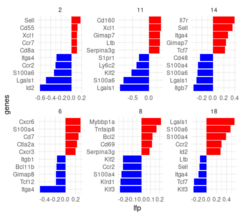

``` r
ggsave(filename = here("Figs", "Waterfall_Marks.pdf"), device = "pdf", width = 5, height = 4.5 ,useDingbats = F)
```

## Heatmaps gene-groups

Beside looking at marker genes, we can inspect the enrichment of a few
manually picked gene-sets.

### Multipotency-related

``` r
select.genes <- c("Myb", "Tcf7","Bcl11b", "Lef1","Ets1", "Runx1", "Klf3", "Id3", "Zeb1", "Eomes",'Bcl6', "Foxo1")

as.data.frame(lfp) %>% 
  dplyr::select(one_of(c('2','14','11','18','8','6'))) %>% 
  rownames_to_column("genes") %>%
  dplyr::filter(genes %in% select.genes) %>% 
  column_to_rownames("genes") %>% 
  as.matrix() %>% 
  pheatmap(scale = "row",breaks = seq(-1.5,1.5,by=0.03), clustering_distance_rows = "euclidean", 
           border_color = NA, cutree_cols = 2, show_rownames = T, cluster_cols = F) -> hm
```

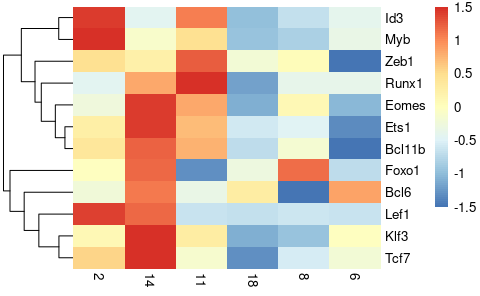

``` r
pdf(file = here("Figs", "Heatmap_multipo.pdf"), width = 3, height = length(select.genes)/3, title = "multipo" )
hm
dev.off()
```

    ## png 
    ##   2

### Survival-related

``` r
select.genes <- c('Gimap4', 'Gimap5', 'Gimap5', 'Gimap7', 'Gimap6', 
                  'Bcl2', 'Bcl11a', 'Traf5',  "Mcl1", "Il7r", "Dedd", 
                  'Birc7','Xiap','Birc6','Birc2','Birc3',"Espl1", "Traf2")

as.data.frame(lfp) %>% 
  dplyr::select(one_of(c('2','14','11','18','8','6'))) %>% 
  rownames_to_column("genes") %>%
  dplyr::filter(genes %in% select.genes) %>% 
  column_to_rownames("genes") %>% 
  as.matrix() %>% 
  pheatmap(scale = "row",breaks = seq(-1.5,1.5,by=0.03), clustering_distance_rows = "euclidean", 
           border_color = NA, cutree_cols = 2, show_rownames = T, cluster_cols = F) -> hm
```

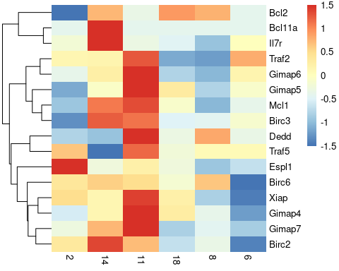

``` r
pdf(file = here("Figs", "Heatmap_survival.pdf"), width = 3, height = length(select.genes)/3, title = "multipo" )
hm
dev.off()
```

    ## png 
    ##   2

### Cytotoxicity-related

``` r
select.genes <- c('Gzma', 'Gzmb','Gzmm', 'Lamp1', 'Lamp2', 
                  'Raet1e', 'Prf1', 'Ctsc', 'Ctsh', 'Ifng',
                  'Ctsd',"Nkg7", "Ctsw", 'Ctsc',"Ctsl","Slamf7", "Cst7")

as.data.frame(lfp) %>% 
  dplyr::select(one_of(c('2','14','11','18','8','6'))) %>% 
  rownames_to_column("genes") %>%
  dplyr::filter(genes %in% select.genes) %>% 
  column_to_rownames("genes") %>% 
  as.matrix() %>% 
  pheatmap(scale = "row",breaks = seq(-1.5,1.5,by=0.03), clustering_distance_rows = "euclidean", 
           border_color = NA, cutree_cols = 2, show_rownames = T, cluster_cols = F) -> hm
```

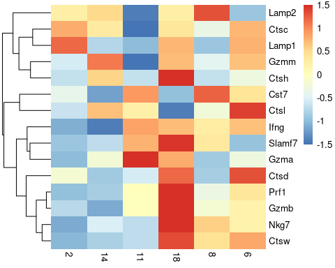

``` r
pdf(file = here("Figs", "Heatmap_cytox.pdf"), width = 3, height = length(select.genes)/3, title = "multipo" )
hm
dev.off()
```

    ## png 
    ##   2

### Inhibitory-related

``` r
select.genes <- c("Lag3", "Pdcd1", 'Havcr2', 'Cd244', 'Ctla4', 'Btla', 'Cd160', 'Tox')

as.data.frame(lfp) %>% 
  dplyr::select(one_of(c('2','14','11','18','8','6'))) %>% 
  rownames_to_column("genes") %>%
  dplyr::filter(genes %in% select.genes) %>% 
  column_to_rownames("genes") %>% 
  as.matrix() %>% 
  pheatmap(scale = "row",breaks = seq(-1.5,1.5,by=0.03), clustering_distance_rows = "euclidean", 
           border_color = NA, cutree_cols = 2, show_rownames = T, cluster_cols = F) -> hm
```

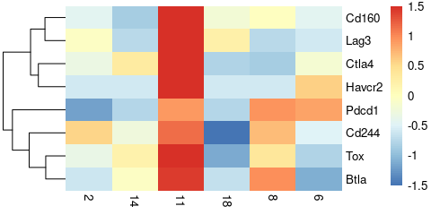

``` r
pdf(file = here("Figs", "Heatmap_inhib.pdf"), width = 3, height = length(select.genes)/3, title = "multipo" )
hm
dev.off()
```

    ## png 
    ##   2

# DGE analysis

From the above analysis, we concluded that low-division Tcm appear less
differentiated compared to high-division Tcm. To verify this in a more
unbiased manner, we can perform a differential gene-expression analysis.

## Differential expression testing

We’ll test for differentially expressed genes using Seurat. Import the
Seurat-object, create a factor defining the groups we want to compare,
and add it to the Seurat-object as metadata.

``` r
seurat.memory <- readRDS(here("Data", "seurat_object_all_exps.rds"))

mc@mc %>% 
  as.factor %>% 
  fct_collapse(Tcm.high = c('18','8','6'),
               Tcm.low = c('2','11','14')) -> Tcm.highVlow


seurat.memory <- AddMetaData(object = seurat.memory, metadata = Tcm.highVlow, col.name = "Tcm.highVlow")

summary(seurat.memory@meta.data$Tcm.highVlow)
```

    ##        1  Tcm.low        3        4        5 Tcm.high        7        9 
    ##     1201     1571      710     3471     2267     3353      385      475 
    ##       10       12       13       15       16       17       19       20 
    ##      835      962      959      723     3313     1182     1962     1736 
    ##       21       22       23     NA's 
    ##     1546      398      510    11992

Ready for differential-expression testing! Used the wilcox-test
implemented in Seurat.

``` r
# Set Identity for DE-analysis
Idents(seurat.memory) <- "Tcm.highVlow"

# Perform DE-analysis
marks <- FindMarkers(object = seurat.memory , ident.1 = 'Tcm.low', ident.2 = 'Tcm.high', 
                     logfc.threshold = 0, test.use = "wilcox", min.pct = 0.1, slot = "counts")

marks %>% 
  rownames_to_column("genes") %>% 
  as_tibble() -> marks

marks
```

    ## # A tibble: 5,787 x 6
    ##    genes      p_val avg_log2FC pct.1 pct.2 p_val_adj
    ##    <chr>      <dbl>      <dbl> <dbl> <dbl>     <dbl>
    ##  1 Lgals1  3.29e-90     -0.614 0.84  0.949  1.02e-85
    ##  2 Vim     2.13e-85     -0.620 0.749 0.9    6.63e-81
    ##  3 S100a6  7.15e-82     -0.546 0.935 0.989  2.22e-77
    ##  4 Xist    3.79e-79      0.738 0.646 0.355  1.18e-74
    ##  5 Gm42418 6.03e-79      0.458 0.985 0.967  1.87e-74
    ##  6 Tmsb10  5.77e-76     -0.310 1     1      1.79e-71
    ##  7 Tmsb4x  3.35e-72     -0.217 1     1      1.04e-67
    ##  8 Crip1   2.55e-67     -0.427 0.974 0.997  7.93e-63
    ##  9 Actg1   2.11e-44     -0.288 0.999 1      6.54e-40
    ## 10 Emp3    1.14e-42     -0.299 0.885 0.948  3.55e-38
    ## # … with 5,777 more rows

``` r
write_tsv(marks, here("Output", "markers_top3VSbot3.tsv"))
```

## Volcano plot

To visualize the results of the DE test, we’ll use a volcano plot. Need
to prep the data a bit; Will add fold-change and significance thresholds
for highlighting genes in the plot (manually set the levels of the
significance factor to control plotting order).

Also add some genes of interest to label in the plot.

``` r
marks %>% 
  mutate(sig = case_when((avg_log2FC < -0.1 | avg_log2FC > 0.1) & p_val_adj < 0.05 ~ "sig", 
                         TRUE ~ "ns") )%>% 
  mutate(sig = factor(sig, levels = c("sig", "ns"))) %>% 
  # select a couple of informative genes for highlighting and labeling
  mutate(to.label = genes %in% c("Il7r", "Tcf7", "Ltb", "Klf3", "Vim", "Lgals1", 
                                 "S100a4", "Nkg7","S100a6","Crip1", "Gzmb", "Ccr2")) -> to.plot

to.plot
```

    ## # A tibble: 5,787 x 8
    ##    genes      p_val avg_log2FC pct.1 pct.2 p_val_adj sig   to.label
    ##    <chr>      <dbl>      <dbl> <dbl> <dbl>     <dbl> <fct> <lgl>   
    ##  1 Lgals1  3.29e-90     -0.614 0.84  0.949  1.02e-85 sig   TRUE    
    ##  2 Vim     2.13e-85     -0.620 0.749 0.9    6.63e-81 sig   TRUE    
    ##  3 S100a6  7.15e-82     -0.546 0.935 0.989  2.22e-77 sig   TRUE    
    ##  4 Xist    3.79e-79      0.738 0.646 0.355  1.18e-74 sig   FALSE   
    ##  5 Gm42418 6.03e-79      0.458 0.985 0.967  1.87e-74 sig   FALSE   
    ##  6 Tmsb10  5.77e-76     -0.310 1     1      1.79e-71 sig   FALSE   
    ##  7 Tmsb4x  3.35e-72     -0.217 1     1      1.04e-67 sig   FALSE   
    ##  8 Crip1   2.55e-67     -0.427 0.974 0.997  7.93e-63 sig   TRUE    
    ##  9 Actg1   2.11e-44     -0.288 0.999 1      6.54e-40 sig   FALSE   
    ## 10 Emp3    1.14e-42     -0.299 0.885 0.948  3.55e-38 sig   FALSE   
    ## # … with 5,777 more rows

And this table can be used to make to plot. Used `geom_text_repel` from
the `ggrepel` package to label the genes.

``` r
ggplot(to.plot, aes( y= log10(p_val) , x=avg_log2FC, color = sig, label = genes) ) + 
  geom_point()+
  scale_y_reverse()+
  scale_color_manual(values=c("red", "darkgrey"))+
  geom_text_repel(data = subset(to.plot, to.label == TRUE ),box.padding = 1.4, max.overlaps = 25 )+
  labs(title = "", x = "log2 fold change", y = "log10 P value")+
  theme(legend.position = "none", plot.title = element_text(hjust = 0.5))+
  geom_hline(yintercept = log10(1.578786e-06), linetype = "dotted")+
  geom_vline(xintercept = c(0.1, -0.1), linetype = "dotted")+
  xlim(-.75,.4)
```

    ## Warning: Removed 2 rows containing missing values (geom_point).

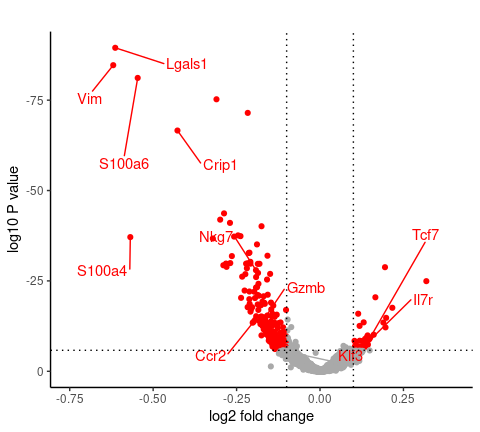

``` r
ggsave(filename = here("Figs", "DE_analysis_Volcano.pdf"), device = "pdf", width = 4.2, height = 6, useDingbats = F)
```

    ## Warning: Removed 2 rows containing missing values (geom_point).

## Heatmaps Immune-genes

We can again use our immune gene list to generate some focused heatmaps
zooming in on our DE genes.

``` r
marks %>% 
  filter(p_val < 0.05 & (avg_log2FC) > 0.05) %>% 
  filter(genes %in% imm.genes) %>% 
  slice_max(avg_log2FC, n = 20) %>% 
  pull(genes) -> gs.up

gs.up
```

    ##  [1] "Itga4"     "Sell"      "Tcf7"      "Tcf12"     "Il7r"      "Xcl1"     
    ##  [7] "Klf3"      "Stat1"     "Gimap7"    "Gzmk"      "Gimap8"    "Serpina3g"
    ## [13] "Jak1"      "Bcl11b"    "Gimap3"    "Eomes"     "Foxp1"     "Cd84"     
    ## [19] "Tnfsf8"    "Zeb1"

``` r
marks %>% 
  filter(p_val < 0.05 & (avg_log2FC) < -0.05) %>% 
  filter(genes %in% imm.genes) %>%
  slice_min(avg_log2FC, n = 20) %>% 
  pull(genes) -> gs.down

gs.down
```

    ##  [1] "Lgals1"  "S100a4"  "S100a6"  "Itgb7"   "Cd2"     "S100a10" "Klrd1"  
    ##  [8] "Cd8b1"   "Cd48"    "Cd7"     "Ccr2"    "Cxcr6"   "Id2"     "Gzmb"   
    ## [15] "Cd3g"    "Klrk1"   "Klf2"    "Cd52"    "Ly6c2"   "S100a11"

### Upregulated ld-Tcm

``` r
as.data.frame(lfp) %>% 
  dplyr::select(one_of(c('2','14','11','18','8','6'))) %>% 
  rownames_to_column("genes") %>%
  filter(genes %in% gs.up) %>% 
  column_to_rownames("genes") %>% 
  as.matrix() %>% 
  pheatmap(scale = "row",breaks = seq(-1.5,1.5,by=0.03), clustering_distance_rows = "euclidean", 
           border_color = NA, cutree_cols = 2, show_rownames = T, cluster_cols = F) -> hm

hm
```

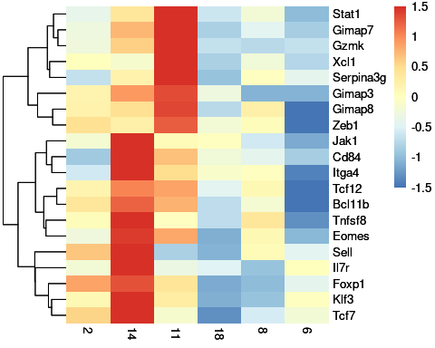

``` r
pdf(here("Figs", "heatmap_ld_genes.pdf"), height = 5, width = 4)
hm
dev.off()
```

    ## png 
    ##   2

### Upregulated hd-Tcm

``` r
as.data.frame(lfp) %>% 
  dplyr::select(one_of(c('2','14','11','18','8','6'))) %>% 
  rownames_to_column("genes") %>%
  filter(genes %in% gs.down) %>% 
  column_to_rownames("genes") %>% 
  as.matrix() %>% 
  pheatmap(scale = "row",breaks = seq(-1.5,1.5,by=0.03), clustering_distance_rows = "euclidean", 
           border_color = NA, cutree_cols = 2, show_rownames = T, cluster_cols = F) -> hm

hm
```

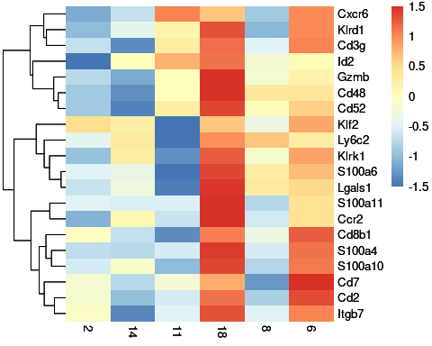

``` r
pdf(here("Figs", "heatmap_hd_genes.pdf"), height = 5, width = 4)
hm
dev.off()
```

    ## png 
    ##   2

## Gene-set enrichment analysis

We can use the DE gene list to perform a gene-set enrichment analysis
using the package `fgsea`. To validate our findings that hd-Tcm appear
more effector-like compared to ld-Tcm we’ll focus on immunity-related
gene-set deposited on MsigDB. We can access these genesets using the
`msigdbr` package.

Immunity related gene-sets are in category C7.

The fgsea function takes a named list of pathways as input, so we’ll
convert the msigdbr output as such.

``` r
pathways <- as.data.frame(msigdbr(species = "Mus musculus", category = "C7"))

colnames(pathways)
```

    ##  [1] "gs_cat"               "gs_subcat"            "gs_name"             
    ##  [4] "entrez_gene"          "gene_symbol"          "human_entrez_gene"   
    ##  [7] "human_gene_symbol"    "gs_id"                "gs_pmid"             
    ## [10] "gs_geoid"             "gs_exact_source"      "gs_url"              
    ## [13] "gs_description"       "species_name"         "species_common_name" 
    ## [16] "ortholog_sources"     "num_ortholog_sources"

``` r
pathways <- split(pathways[, 5], pathways[, 3])

str(pathways)
```

    ## List of 4872
    ##  $ GOLDRATH_EFF_VS_MEMORY_CD8_TCELL_DN                                                               : chr [1:200] "Abca2" "Abcc5" "Abhd14a" "Acadm" ...
    ##  $ GOLDRATH_EFF_VS_MEMORY_CD8_TCELL_UP                                                               : chr [1:197] "Adam8" "Ak3" "Anln" "Anxa1" ...
    ##  $ GOLDRATH_NAIVE_VS_EFF_CD8_TCELL_DN                                                                : chr [1:197] "Acot7" "Adam8" "Anln" "Anxa1" ...
    ##  $ GOLDRATH_NAIVE_VS_EFF_CD8_TCELL_UP                                                                : chr [1:199] "Aamp" "Abcc5" "Abcd3" "Abcg1" ...
    ##  $ GOLDRATH_NAIVE_VS_MEMORY_CD8_TCELL_DN                                                             : chr [1:199] "Abcb1a" "Abhd5" "Acot7" "Acy1" ...
    ##  $ GOLDRATH_NAIVE_VS_MEMORY_CD8_TCELL_UP                                                             : chr [1:199] "Acp5" "Actn1" "Actn2" "Acvrl1" ...
    ##  $ GSE10094_LCMV_VS_LISTERIA_IND_EFF_CD4_TCELL_DN                                                    : chr [1:196] "Abca12" "Accsl" "Adcy6" "Adprhl2" ...
    ##  $ GSE10094_LCMV_VS_LISTERIA_IND_EFF_CD4_TCELL_UP                                                    : chr [1:200] "Abcb1a" "Acsf3" "Acss1" "Alg5" ...
    ##  $ GSE10147_IL3_AND_HIVP17_VS_IL3_AND_CPG_STIM_PDC_DN                                                : chr [1:150] "Aco2" "Actr1a" "Adck1" "Adrb2" ...
    ##  $ GSE10147_IL3_AND_HIVP17_VS_IL3_AND_CPG_STIM_PDC_UP                                                : chr [1:153] "A3galt2" "Acacb" "Actbl2" "Actg2" ...
    ##  $ GSE10147_IL3_VS_IL3_AND_CPG_STIM_PDC_DN                                                           : chr [1:163] "Abca3" "Acaa2" "Adamts14" "Ahi1" ...
    ##  $ GSE10147_IL3_VS_IL3_AND_CPG_STIM_PDC_UP                                                           : chr [1:142] "Abhd16b" "Abi3bp" "Acer1" "Actbl2" ...
    ##  $ GSE10147_IL3_VS_IL3_AND_HIVP17_STIM_PDC_DN                                                        : chr [1:143] "Abhd14b" "Ahsg" "Antxr1" "Apln" ...
    ##  $ GSE10147_IL3_VS_IL3_AND_HIVP17_STIM_PDC_UP                                                        : chr [1:163] "Acbd4" "Adi1" "Ago1" "Akap11" ...
    ##  $ GSE10211_UV_INACT_SENDAI_VS_LIVE_SENDAI_VIRUS_TRACHEAL_EPITHELIAL_CELLS_DN                        : chr [1:162] "Acad9" "Acot7" "Acot10" "Acot9" ...
    ##  $ GSE10211_UV_INACT_SENDAI_VS_LIVE_SENDAI_VIRUS_TRACHEAL_EPITHELIAL_CELLS_UP                        : chr [1:149] "Abtb2" "Actr8" "Actrt2" "Acyp1" ...
    ##  $ GSE10239_KLRG1INT_VS_KLRG1HIGH_EFF_CD8_TCELL_DN                                                   : chr [1:202] "Abracl" "Abraxas1" "Abraxas2" "Adgre1" ...
    ##  $ GSE10239_KLRG1INT_VS_KLRG1HIGH_EFF_CD8_TCELL_UP                                                   : chr [1:198] "Aarsd1" "Acaa1b" "Acot7" "Acsf3" ...
    ##  $ GSE10239_MEMORY_VS_DAY4.5_EFF_CD8_TCELL_DN                                                        : chr [1:200] "Aasdh" "Actl6a" "Actr3" "Ahcyl2" ...
    ##  $ GSE10239_MEMORY_VS_DAY4.5_EFF_CD8_TCELL_UP                                                        : chr [1:197] "Adgrg5" "Akap9" "Alb" "Amn" ...
    ##  $ GSE10239_MEMORY_VS_KLRG1HIGH_EFF_CD8_TCELL_DN                                                     : chr [1:199] "Aco1" "Acot10" "Acot9" "Actl6a" ...
    ##  $ GSE10239_MEMORY_VS_KLRG1HIGH_EFF_CD8_TCELL_UP                                                     : chr [1:197] "Ache" "Adam33" "Adcy2" "Agpat1" ...
    ##  $ GSE10239_MEMORY_VS_KLRG1INT_EFF_CD8_TCELL_DN                                                      : chr [1:199] "Aco1" "Actl6a" "Actr3" "Acyp2" ...
    ##  $ GSE10239_MEMORY_VS_KLRG1INT_EFF_CD8_TCELL_UP                                                      : chr [1:199] "A1cf" "Abi1" "Adam33" "Aipl1" ...
    ##  $ GSE10239_NAIVE_VS_DAY4.5_EFF_CD8_TCELL_DN                                                         : chr [1:198] "Abcb10" "Acot7" "Acsm1" "Aldh7a1" ...
    ##  $ GSE10239_NAIVE_VS_DAY4.5_EFF_CD8_TCELL_UP                                                         : chr [1:199] "Abhd15" "Acp6" "Acss1" "Acvr1b" ...
    ##  $ GSE10239_NAIVE_VS_KLRG1HIGH_EFF_CD8_TCELL_DN                                                      : chr [1:198] "Actl6a" "Akip1" "Alad" "Alg8" ...
    ##  $ GSE10239_NAIVE_VS_KLRG1HIGH_EFF_CD8_TCELL_UP                                                      : chr [1:197] "Abtb1" "Acp6" "Acvr1b" "Adal" ...
    ##  $ GSE10239_NAIVE_VS_KLRG1INT_EFF_CD8_TCELL_DN                                                       : chr [1:199] "Aimp2" "Akap1" "Alad" "Aldh7a1" ...
    ##  $ GSE10239_NAIVE_VS_KLRG1INT_EFF_CD8_TCELL_UP                                                       : chr [1:198] "Abtb1" "Acp6" "Adal" "Adgrl1" ...
    ##  $ GSE10239_NAIVE_VS_MEMORY_CD8_TCELL_DN                                                             : chr [1:193] "Abcb10" "Acot7" "Acsbg1" "Adam33" ...
    ##  $ GSE10239_NAIVE_VS_MEMORY_CD8_TCELL_UP                                                             : chr [1:199] "Abcb7" "Abcd3" "Abtb1" "Acap2" ...
    ##  $ GSE10240_CTRL_VS_IL17_AND_IL22_STIM_PRIMARY_BRONCHIAL_EPITHELIAL_CELLS_DN                         : chr [1:199] "Abcb10" "Abl2" "Adgrb1" "Adgrl4" ...
    ##  $ GSE10240_CTRL_VS_IL17_AND_IL22_STIM_PRIMARY_BRONCHIAL_EPITHELIAL_CELLS_UP                         : chr [1:198] "Aar2" "Aarsd1" "Abcf2" "Acp5" ...
    ##  $ GSE10240_CTRL_VS_IL17_STIM_PRIMARY_BRONCHIAL_EPITHELIAL_CELLS_DN                                  : chr [1:197] "Aaas" "Aagab" "Abca1" "Acin1" ...
    ##  $ GSE10240_CTRL_VS_IL17_STIM_PRIMARY_BRONCHIAL_EPITHELIAL_CELLS_UP                                  : chr [1:199] "Aagab" "Adcy5" "Adcy6" "Alg8" ...
    ##  $ GSE10240_CTRL_VS_IL22_STIM_PRIMARY_BRONCHIAL_EPITHELIAL_CELLS_DN                                  : chr [1:198] "Abhd1" "Abi3" "Adam10" "Aip" ...
    ##  $ GSE10240_CTRL_VS_IL22_STIM_PRIMARY_BRONCHIAL_EPITHELIAL_CELLS_UP                                  : chr [1:198] "Abca1" "Abcc1" "Abhd14b" "Abhd4" ...
    ##  $ GSE10240_IL17_VS_IL17_AND_IL22_STIM_PRIMARY_BRONCHIAL_EPITHELIAL_CELLS_DN                         : chr [1:199] "Abca3" "Abi2" "Abl2" "Amtn" ...
    ##  $ GSE10240_IL17_VS_IL17_AND_IL22_STIM_PRIMARY_BRONCHIAL_EPITHELIAL_CELLS_UP                         : chr [1:199] "Acbd4" "Acss2" "Adap1" "Add1" ...
    ##  $ GSE10240_IL22_VS_IL17_STIM_PRIMARY_BRONCHIAL_EPITHELIAL_CELLS_DN                                  : chr [1:199] "Abca9" "Abcc4" "Acsl1" "Ak4" ...
    ##  $ GSE10240_IL22_VS_IL17_STIM_PRIMARY_BRONCHIAL_EPITHELIAL_CELLS_UP                                  : chr [1:200] "Abhd10" "Actr6" "Afg3l2" "Agl" ...
    ##  $ GSE10240_IL22_VS_IL22_AND_IL17_STIM_PRIMARY_BRONCHIAL_EPITHELIAL_CELLS_DN                         : chr [1:200] "Ablim1" "Adap2" "Adgrg3" "Akap13" ...
    ##  $ GSE10240_IL22_VS_IL22_AND_IL17_STIM_PRIMARY_BRONCHIAL_EPITHELIAL_CELLS_UP                         : chr [1:199] "Aak1" "Abcb1a" "Add1" "Akna" ...
    ##  $ GSE10273_HIGH_IL7_VS_HIGH_IL7_AND_IRF4_IN_IRF4_8_NULL_PRE_BCELL_DN                                : chr [1:197] "Abcf2" "Abtb2" "Adgrb1" "Aldh7a1" ...
    ##  $ GSE10273_HIGH_IL7_VS_HIGH_IL7_AND_IRF4_IN_IRF4_8_NULL_PRE_BCELL_UP                                : chr [1:202] "Acvr1c" "Adamts3" "Adi1" "Adm" ...
    ##  $ GSE10273_HIGH_VS_LOW_IL7_TREATED_IRF4_8_NULL_PRE_BCELL_DN                                         : chr [1:199] "Abhd1" "Adamtsl4" "Agpat3" "Akna" ...
    ##  $ GSE10273_HIGH_VS_LOW_IL7_TREATED_IRF4_8_NULL_PRE_BCELL_UP                                         : chr [1:198] "Abca9" "Abcb10" "Acap2" "Acox1" ...
    ##  $ GSE10273_LOW_IL7_VS_HIGH_IL7_AND_IRF4_IN_IRF4_8_NULL_PRE_BCELL_DN                                 : chr [1:201] "Adar" "Agpat3" "Aldh18a1" "Anapc2" ...
    ##  $ GSE10273_LOW_IL7_VS_HIGH_IL7_AND_IRF4_IN_IRF4_8_NULL_PRE_BCELL_UP                                 : chr [1:199] "Aarsd1" "Abi2" "Ada" "Adam9" ...
    ##  $ GSE10325_BCELL_VS_LUPUS_BCELL_DN                                                                  : chr [1:197] "Acsl4" "Adar" "Aicda" "Anp32e" ...
    ##  $ GSE10325_BCELL_VS_LUPUS_BCELL_UP                                                                  : chr [1:180] "Abca3" "Abcb8" "Abcg5" "Abo" ...
    ##  $ GSE10325_BCELL_VS_MYELOID_DN                                                                      : chr [1:200] "Actg1" "Adgre1" "Adgre4" "Adm" ...
    ##  $ GSE10325_BCELL_VS_MYELOID_UP                                                                      : chr [1:182] "Abcb4" "Ablim1" "Acap1" "Adam19" ...
    ##  $ GSE10325_CD4_TCELL_VS_BCELL_DN                                                                    : chr [1:180] "Abcb4" "Adam19" "Adam28" "Adk" ...
    ##  $ GSE10325_CD4_TCELL_VS_BCELL_UP                                                                    : chr [1:196] "Aak1" "Acvr1" "Ak5" "Aktip" ...
    ##  $ GSE10325_CD4_TCELL_VS_LUPUS_CD4_TCELL_DN                                                          : chr [1:187] "Adgrg6" "Adgrv1" "Aim2" "Anxa10" ...
    ##  $ GSE10325_CD4_TCELL_VS_LUPUS_CD4_TCELL_UP                                                          : chr [1:194] "Abca3" "Abcb1a" "Ablim1" "Adarb1" ...
    ##  $ GSE10325_CD4_TCELL_VS_MYELOID_DN                                                                  : chr [1:191] "Actg1" "Adm" "Adora2b" "Aldh2" ...
    ##  $ GSE10325_CD4_TCELL_VS_MYELOID_UP                                                                  : chr [1:192] "Adprm" "Akt3" "Aktip" "Aldoc" ...
    ##  $ GSE10325_LUPUS_BCELL_VS_LUPUS_MYELOID_DN                                                          : chr [1:206] "Acot10" "Acot9" "Actb" "Acvr1b" ...
    ##  $ GSE10325_LUPUS_BCELL_VS_LUPUS_MYELOID_UP                                                          : chr [1:181] "Ablim1" "Acyp1" "Adam19" "Adk" ...
    ##  $ GSE10325_LUPUS_CD4_TCELL_VS_LUPUS_BCELL_DN                                                        : chr [1:181] "Abcb4" "Adam28" "Adk" "Agpat5" ...
    ##  $ GSE10325_LUPUS_CD4_TCELL_VS_LUPUS_BCELL_UP                                                        : chr [1:196] "Abitram" "Actn1" "Acvr1" "Adgre1" ...
    ##  $ GSE10325_LUPUS_CD4_TCELL_VS_LUPUS_MYELOID_DN                                                      : chr [1:199] "Acsl1" "Adap2" "Aif1" "Aldh2" ...
    ##  $ GSE10325_LUPUS_CD4_TCELL_VS_LUPUS_MYELOID_UP                                                      : chr [1:194] "Ablim1" "Acap1" "Akt3" "Ank3" ...
    ##  $ GSE10325_MYELOID_VS_LUPUS_MYELOID_DN                                                              : chr [1:196] "Abcc10" "Acp2" "Acsl1" "Adam17" ...
    ##  $ GSE10325_MYELOID_VS_LUPUS_MYELOID_UP                                                              : chr [1:182] "Abca12" "Abca4" "Abcb4" "Acadl" ...
    ##  $ GSE10422_WT_VS_BAFF_TRANSGENIC_LN_BCELL_DN                                                        : chr [1:125] "Abhd14a" "Acadl" "Acyp1" "Aifm2" ...
    ##  $ GSE10422_WT_VS_BAFF_TRANSGENIC_LN_BCELL_UP                                                        : chr [1:175] "Acaca" "Acap3" "Acpp" "Acsf2" ...
    ##  $ GSE10463_CD40L_AND_VA347_VS_CD40L_IN_DC_DN                                                        : chr [1:156] "Aarsd1" "Adamts15" "Adamtsl2" "Adck2" ...
    ##  $ GSE10463_CD40L_AND_VA347_VS_CD40L_IN_DC_UP                                                        : chr [1:173] "Aatk" "Abcb4" "Abhd12" "Adprm" ...
    ##  $ GSE10500_ARTHRITIC_SYNOVIAL_FLUID_VS_HEALTHY_MACROPHAGE_DN                                        : chr [1:142] "Acvr2a" "Adgrb3" "Ahi1" "Akap11" ...
    ##  $ GSE10500_ARTHRITIC_SYNOVIAL_FLUID_VS_HEALTHY_MACROPHAGE_UP                                        : chr [1:148] "Abhd14a" "Acadl" "Agpat4" "Anapc7" ...
    ##  $ GSE10856_CTRL_VS_TNFRSF6B_IN_MACROPHAGE_DN                                                        : chr [1:179] "Aarsd1" "Acadm" "Acer3" "Acss3" ...
    ##  $ GSE10856_CTRL_VS_TNFRSF6B_IN_MACROPHAGE_UP                                                        : chr [1:172] "Abcc5" "Abl1" "Adamts18" "Adi1" ...
    ##  $ GSE11057_CD4_CENT_MEM_VS_PBMC_DN                                                                  : chr [1:192] "Abhd5" "Acsl1" "Adamtsl4" "Alox12" ...
    ##  $ GSE11057_CD4_CENT_MEM_VS_PBMC_UP                                                                  : chr [1:195] "Abcc1" "Abcc10" "Abhd14a" "Abi2" ...
    ##  $ GSE11057_CD4_EFF_MEM_VS_PBMC_DN                                                                   : chr [1:191] "Acer3" "Acrbp" "Acsl1" "Adamtsl4" ...
    ##  $ GSE11057_CD4_EFF_MEM_VS_PBMC_UP                                                                   : chr [1:191] "Acat3" "Ace" "Adsl" "Afdn" ...
    ##  $ GSE11057_EFF_MEM_VS_CENT_MEM_CD4_TCELL_DN                                                         : chr [1:175] "Abcc1" "Abcc2" "Ablim1" "Acod1" ...
    ##  $ GSE11057_EFF_MEM_VS_CENT_MEM_CD4_TCELL_UP                                                         : chr [1:181] "Abcb1a" "Acsl6" "Actn4" "Adam8" ...
    ##  $ GSE11057_NAIVE_CD4_VS_PBMC_CD4_TCELL_DN                                                           : chr [1:193] "Acer3" "Actb" "Actn4" "Adam8" ...
    ##  $ GSE11057_NAIVE_CD4_VS_PBMC_CD4_TCELL_UP                                                           : chr [1:177] "Ablim1" "Adsl" "Agmat" "Ak5" ...
    ##  $ GSE11057_NAIVE_VS_CENT_MEMORY_CD4_TCELL_DN                                                        : chr [1:197] "Abcc1" "Acot10" "Acot9" "Actn4" ...
    ##  $ GSE11057_NAIVE_VS_CENT_MEMORY_CD4_TCELL_UP                                                        : chr [1:168] "Ablim1" "Adamts12" "Adgrf3" "Aebp1" ...
    ##  $ GSE11057_NAIVE_VS_EFF_MEMORY_CD4_TCELL_DN                                                         : chr [1:187] "Actn4" "Adam19" "Afdn" "Ago4" ...
    ##  $ GSE11057_NAIVE_VS_EFF_MEMORY_CD4_TCELL_UP                                                         : chr [1:172] "Aars" "Ablim1" "Acer1" "Acss2" ...
    ##  $ GSE11057_NAIVE_VS_MEMORY_CD4_TCELL_DN                                                             : chr [1:196] "Acot10" "Acot9" "Actb" "Acvr1" ...
    ##  $ GSE11057_NAIVE_VS_MEMORY_CD4_TCELL_UP                                                             : chr [1:168] "Ablim1" "Acer1" "Adgra3" "Adgrl1" ...
    ##  $ GSE11057_PBMC_VS_MEM_CD4_TCELL_DN                                                                 : chr [1:185] "Acat3" "Acsl6" "Acvr1" "Ammecr1" ...
    ##  $ GSE11057_PBMC_VS_MEM_CD4_TCELL_UP                                                                 : chr [1:194] "Acrbp" "Adam9" "Aldh1a1" "Anpep" ...
    ##  $ GSE1112_HY_CD8AB_VS_HY_CD8AA_THYMOCYTE_RTOC_CULTURE_DN                                            : chr [1:171] "Abca1" "Acvr1b" "Adm" "Ago3" ...
    ##  $ GSE1112_HY_CD8AB_VS_HY_CD8AA_THYMOCYTE_RTOC_CULTURE_UP                                            : chr [1:172] "Adamts6" "Adcy5" "Ak8" "Ankfn1" ...
    ##  $ GSE1112_OT1_CD8AB_VS_HY_CD8AA_THYMOCYTE_RTOC_CULTURE_DN                                           : chr [1:171] "Abhd14b" "Acly" "Adnp" "Adprhl1" ...
    ##  $ GSE1112_OT1_CD8AB_VS_HY_CD8AA_THYMOCYTE_RTOC_CULTURE_UP                                           : chr [1:136] "Abi3" "Ace2" "Acrbp" "Actn3" ...
    ##  $ GSE1112_OT1_VS_HY_CD8AB_THYMOCYTE_RTOC_CULTURE_DN                                                 : chr [1:193] "Aasdh" "Acaca" "Acad8" "Acad9" ...
    ##  $ GSE1112_OT1_VS_HY_CD8AB_THYMOCYTE_RTOC_CULTURE_UP                                                 : chr [1:188] "Acin1" "Acox3" "Adamtsl4" "Aifm1" ...
    ##  $ GSE11367_CTRL_VS_IL17_TREATED_SMOOTH_MUSCLE_CELL_DN                                               : chr [1:111] "Abhd10" "Adgrf1" "Adgrg5" "Adra1b" ...
    ##   [list output truncated]

The second input for the `fgsea` function is a named numeric vector;
names being genes and values being the values by which the gene-rank
will be derived (fold-change in this case).

We’ll focus of genes that are P &lt; 0.05.

``` r
marks %>% 
  filter(p_val < 0.05) %>%  
  dplyr::select(genes, avg_log2FC) %>% 
  deframe %>% 
  sort(decreasing = T) -> stats

head(stats, 25)
```

    ##      Xist   Gm42418     Itga4     Macf1    Samd9l    Trip11     Ptprc      Utrn 
    ## 0.7381599 0.4576945 0.3185975 0.2167130 0.1981419 0.1962823 0.1947208 0.1897802 
    ##     Mbnl1     Kmt2a      Cyld      Cmah      Rpl9   Zcchc11      Sell    Luc7l2 
    ## 0.1659048 0.1609639 0.1505424 0.1487959 0.1478938 0.1443390 0.1434906 0.1427040 
    ##      Tcf7     Tcf12      Il7r    Ifi203    Cdkn1b    Prrc2c      Atrx      Xcl1 
    ## 0.1416046 0.1410931 0.1384282 0.1371482 0.1360237 0.1350931 0.1340962 0.1337103 
    ##      Ets1 
    ## 0.1326334

Used the fgsea function to calculate gene-set enrichment. The minSize
argument sets the minimal amount of genes that should be present in the
dataset for the geneset to be included in the analysis.

``` r
fgseaRes <- as_tibble(fgsea(pathways=pathways, stats=stats, minSize = 20))
```

    ## Warning in preparePathwaysAndStats(pathways, stats, minSize, maxSize, gseaParam, : There are ties in the preranked stats (0.24% of the list).
    ## The order of those tied genes will be arbitrary, which may produce unexpected results.

    ## Warning in fgseaMultilevel(...): For some pathways, in reality P-values are less
    ## than 1e-10. You can set the `eps` argument to zero for better estimation.

``` r
fgseaRes
```

    ## # A tibble: 4,002 x 8
    ##    pathway                 pval     padj log2err     ES    NES  size leadingEdge
    ##    <chr>                  <dbl>    <dbl>   <dbl>  <dbl>  <dbl> <int> <list>     
    ##  1 GOLDRATH_EFF_VS_ME… 2.09e- 1  4.31e-1  0.249   0.202  1.21     64 <chr [19]> 
    ##  2 GOLDRATH_EFF_VS_ME… 1.49e- 7  1.27e-5  0.690  -0.665 -2.56     31 <chr [11]> 
    ##  3 GOLDRATH_NAIVE_VS_… 8.56e-10  1.63e-7  0.801  -0.684 -2.77     38 <chr [17]> 
    ##  4 GOLDRATH_NAIVE_VS_… 8.84e- 1  9.36e-1  0.0246 -0.155 -0.681    57 <chr [20]> 
    ##  5 GOLDRATH_NAIVE_VS_… 2.38e- 9  3.97e-7  0.775  -0.601 -2.63     55 <chr [25]> 
    ##  6 GOLDRATH_NAIVE_VS_… 2.20e- 1  4.45e-1  0.0934 -0.281 -1.22     52 <chr [17]> 
    ##  7 GSE10094_LCMV_VS_L… 1.39e- 4  2.89e-3  0.519   0.387  2.15     49 <chr [32]> 
    ##  8 GSE10147_IL3_AND_H… 1.73e- 1  3.87e-1  0.117  -0.386 -1.31     20 <chr [8]>  
    ##  9 GSE10147_IL3_VS_IL… 9.66e- 1  9.82e-1  0.0274 -0.153 -0.518    20 <chr [20]> 
    ## 10 GSE10147_IL3_VS_IL… 2.84e- 1  5.14e-1  0.180   0.245  1.14     24 <chr [15]> 
    ## # … with 3,992 more rows

We specifically focused on the gene-sets deposited by Kaech and
Goldrath, as these are most relevant to our question.

Also edited the names of the pathways a bit to make them a bit nicer in
the plot. And reorder based on Normalized Enrichment Score.

``` r
fgseaRes %>% 
  filter(padj < 0.05)  %>% 
  filter(grepl("KAECH|GOLDRATH", pathway)) %>% 
  mutate(pathway = gsub("GOLDRATH", "GR", pathway),
         pathway = gsub("KAECH", "KA", pathway),
         pathway = gsub("_CD8_TCELL", "", pathway),
         pathway = gsub("_", " ", pathway),
         pathway = str_to_lower(pathway)) %>% 
  mutate(pathway = fct_reorder(as.factor(pathway), NES)) -> to.plot

to.plot
```

    ## # A tibble: 11 x 8
    ##    pathway                 pval      padj log2err     ES   NES  size leadingEdge
    ##    <fct>                  <dbl>     <dbl>   <dbl>  <dbl> <dbl> <int> <list>     
    ##  1 gr eff vs memory up 1.49e- 7   1.27e-5   0.690 -0.665 -2.56    31 <chr [11]> 
    ##  2 gr naive vs eff dn  8.56e-10   1.63e-7   0.801 -0.684 -2.77    38 <chr [17]> 
    ##  3 gr naive vs memory… 2.38e- 9   3.97e-7   0.775 -0.601 -2.63    55 <chr [25]> 
    ##  4 ka day15 eff vs me… 2.44e- 3   2.53e-2   0.432 -0.501 -1.92    30 <chr [12]> 
    ##  5 ka day8 eff vs day… 4.23e- 3   3.76e-2   0.407  0.350  1.92    42 <chr [23]> 
    ##  6 ka day8 eff vs day… 1.65e- 7   1.35e-5   0.690 -0.511 -2.39    80 <chr [54]> 
    ##  7 ka day8 eff vs mem… 5.72e- 5   1.41e-3   0.557 -0.500 -2.19    56 <chr [22]> 
    ##  8 ka naive vs day15 … 1   e-10   2.50e-8  NA     -0.625 -2.81    66 <chr [31]> 
    ##  9 ka naive vs day8 e… 1   e-10   2.50e-8  NA     -0.607 -2.81    76 <chr [39]> 
    ## 10 ka naive vs day8 e… 3.53e- 3   3.34e-2   0.432  0.352  1.93    42 <chr [14]> 
    ## 11 ka naive vs memory… 1   e-10   2.50e-8  NA     -0.600 -2.77    75 <chr [36]>

And plot the results:

``` r
ggplot(to.plot, aes(x = NES, y = pathway))+
  geom_point(aes(size = size, color  = padj))+
  grids(axis = "y", linetype = "dashed")+
  geom_vline(xintercept = 0, color = "blue", linetype = "dotted")
```

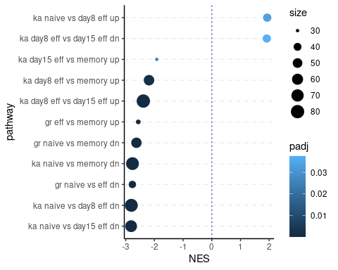

``` r
ggsave(filename = here("Figs", "Pathways_C7.pdf"),device =  "pdf", height = 4, width = 5)
```

Make example plot Goldrath pathway. fgsea has a nice build in function
for this called `plotEnrichment`.

``` r
pw <-  "GOLDRATH_NAIVE_VS_MEMORY_CD8_TCELL_DN"

nes <- fgseaRes %>%  filter(pathway == pw) %>%  pull(NES) %>% round(digits = 2)

plotEnrichment(pathway = pathways[[pw]], stats)+
  ggtitle(pw)+
  geom_text(aes(label = paste0(c("NES = ", as.character(nes)), collapse = ""), x = Inf, y = Inf  ), vjust = "inward", hjust = "inward")
```

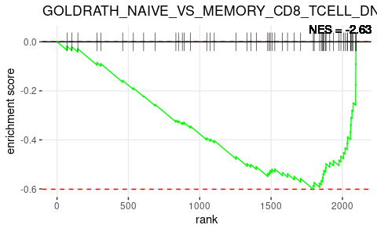

``` r
ggsave(filename = here("Figs", "GSEA_GOLDRATH_EFF.pdf") , device = "pdf", width = 5, height = 3 ,useDingbats = F)
```

Make example plot Kaech pathway. fgsea has a nice build in function for
this.

``` r
pw <-  "KAECH_NAIVE_VS_DAY8_EFF_CD8_TCELL_DN"

nes <- fgseaRes %>%  filter(pathway == pw) %>%  pull(NES) %>% round(digits = 2)

plotEnrichment(pathway = pathways[[pw]], stats)+
  ggtitle(pw)+
  geom_text(aes(label = paste0(c("NES = ", as.character(nes)), collapse = ""), x = Inf, y = Inf  ), vjust = "inward", hjust = "inward")
```

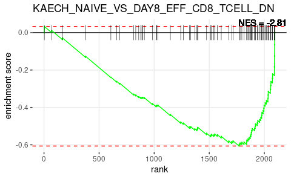

``` r
ggsave(filename = here("Figs", "GSEA_KAECH_EFF.pdf") , device = "pdf", width = 5, height = 3 ,useDingbats = F)
```

# Quiescence of ld-Tcm

As ld-Tcm have a low division history, we hypothesized that these cells
may have a transcriptome that reflects a quiescent state. Below some
analysis we included to test this.

## GSEA on hallmark sigs

We first checked our DE gene-list for enrichment for specific Hallmark
gene-set. Analysis will be similar to the one performed above. First get
the pathways and convert to named list

``` r
pathways <- as.data.frame(msigdbr(species = "Mus musculus", category = "H"))

colnames(pathways)
```

    ##  [1] "gs_cat"               "gs_subcat"            "gs_name"             
    ##  [4] "entrez_gene"          "gene_symbol"          "human_entrez_gene"   
    ##  [7] "human_gene_symbol"    "gs_id"                "gs_pmid"             
    ## [10] "gs_geoid"             "gs_exact_source"      "gs_url"              
    ## [13] "gs_description"       "species_name"         "species_common_name" 
    ## [16] "ortholog_sources"     "num_ortholog_sources"

``` r
pathways <- split(pathways[, 5], pathways[, 3])

str(pathways)
```

    ## List of 50
    ##  $ HALLMARK_ADIPOGENESIS                     : chr [1:200] "Abca1" "Abcb8" "Acaa2" "Acadl" ...
    ##  $ HALLMARK_ALLOGRAFT_REJECTION              : chr [1:198] "Aars" "Abce1" "Abi1" "Ache" ...
    ##  $ HALLMARK_ANDROGEN_RESPONSE                : chr [1:99] "Abcc4" "Abhd2" "Acsl3" "Actn1" ...
    ##  $ HALLMARK_ANGIOGENESIS                     : chr [1:36] "Apoh" "App" "Ccnd2" "Col3a1" ...
    ##  $ HALLMARK_APICAL_JUNCTION                  : chr [1:199] "Acta1" "Actb" "Actc1" "Actg1" ...
    ##  $ HALLMARK_APICAL_SURFACE                   : chr [1:44] "Adam10" "Adipor2" "Afap1l2" "Akap7" ...
    ##  $ HALLMARK_APOPTOSIS                        : chr [1:161] "Add1" "Aifm3" "Ank" "Anxa1" ...
    ##  $ HALLMARK_BILE_ACID_METABOLISM             : chr [1:112] "Abca1" "Abca2" "Abca3" "Abca4" ...
    ##  $ HALLMARK_CHOLESTEROL_HOMEOSTASIS          : chr [1:74] "Abca2" "Acat3" "Acss2" "Actg1" ...
    ##  $ HALLMARK_COAGULATION                      : chr [1:141] "A2m" "Acox2" "Adam9" "Ang" ...
    ##  $ HALLMARK_COMPLEMENT                       : chr [1:197] "Actn2" "Adam9" "Adra2b" "Akap10" ...
    ##  $ HALLMARK_DNA_REPAIR                       : chr [1:150] "Aaas" "Ada" "Adcy6" "Adrm1" ...
    ##  $ HALLMARK_E2F_TARGETS                      : chr [1:200] "Ak2" "Anp32e" "Asf1a" "Asf1b" ...
    ##  $ HALLMARK_EPITHELIAL_MESENCHYMAL_TRANSITION: chr [1:199] "Abi3bp" "Acta2" "Adam12" "Anpep" ...
    ##  $ HALLMARK_ESTROGEN_RESPONSE_EARLY          : chr [1:200] "Abat" "Abca3" "Abhd2" "Ablim1" ...
    ##  $ HALLMARK_ESTROGEN_RESPONSE_LATE           : chr [1:202] "Abca3" "Abhd2" "Acox2" "Add3" ...
    ##  $ HALLMARK_FATTY_ACID_METABOLISM            : chr [1:160] "Aadat" "Acaa1b" "Acaa2" "Acadl" ...
    ##  $ HALLMARK_G2M_CHECKPOINT                   : chr [1:199] "Abl1" "Amd1" "Arid4a" "Atf5" ...
    ##  $ HALLMARK_GLYCOLYSIS                       : chr [1:200] "Abcb6" "Adora2b" "Agl" "Agrn" ...
    ##  $ HALLMARK_HEDGEHOG_SIGNALING               : chr [1:36] "Ache" "Adgrg1" "Amot" "Cdk5r1" ...
    ##  $ HALLMARK_HEME_METABOLISM                  : chr [1:196] "Abcb6" "Abcg2" "Ackr1" "Acp5" ...
    ##  $ HALLMARK_HYPOXIA                          : chr [1:200] "Ackr3" "Adm" "Adora2b" "Ak4" ...
    ##  $ HALLMARK_IL2_STAT5_SIGNALING              : chr [1:199] "Abcb1a" "Adam19" "Ager" "Ahcy" ...
    ##  $ HALLMARK_IL6_JAK_STAT3_SIGNALING          : chr [1:89] "A2m" "Acvr1b" "Acvrl1" "Bak1" ...
    ##  $ HALLMARK_INFLAMMATORY_RESPONSE            : chr [1:200] "Abca1" "Abi1" "Acvr1b" "Acvr2a" ...
    ##  $ HALLMARK_INTERFERON_ALPHA_RESPONSE        : chr [1:95] "Adar" "B2m" "Batf2" "Bst2" ...
    ##  $ HALLMARK_INTERFERON_GAMMA_RESPONSE        : chr [1:196] "Adar" "Apol6" "Arid5b" "Arl4a" ...
    ##  $ HALLMARK_KRAS_SIGNALING_DN                : chr [1:202] "Abcb11" "Abcg4" "Actc1" "Adra2c" ...
    ##  $ HALLMARK_KRAS_SIGNALING_UP                : chr [1:200] "Abcb1a" "Ace" "Adam17" "Adam8" ...
    ##  $ HALLMARK_MITOTIC_SPINDLE                  : chr [1:199] "Abi1" "Abl1" "Abr" "Actn4" ...
    ##  $ HALLMARK_MTORC1_SIGNALING                 : chr [1:200] "Abcf2" "Acaca" "Acly" "Acsl3" ...
    ##  $ HALLMARK_MYC_TARGETS_V1                   : chr [1:200] "Abce1" "Acp1" "Aimp2" "Ap3s1" ...
    ##  $ HALLMARK_MYC_TARGETS_V2                   : chr [1:58] "Aimp2" "Bysl" "Cbx3" "Cdk4" ...
    ##  $ HALLMARK_MYOGENESIS                       : chr [1:200] "Ablim1" "Ache" "Acsl1" "Acta1" ...
    ##  $ HALLMARK_NOTCH_SIGNALING                  : chr [1:32] "Aph1a" "Arrb1" "Ccnd1" "Cul1" ...
    ##  $ HALLMARK_OXIDATIVE_PHOSPHORYLATION        : chr [1:199] "Abcb7" "Acaa1b" "Acaa2" "Acadm" ...
    ##  $ HALLMARK_P53_PATHWAY                      : chr [1:199] "Abat" "Abcc5" "Abhd4" "Acvr1b" ...
    ##  $ HALLMARK_PANCREAS_BETA_CELLS              : chr [1:40] "Abcc8" "Akt3" "Chga" "Dcx" ...
    ##  $ HALLMARK_PEROXISOME                       : chr [1:103] "Abcb1a" "Abcb4" "Abcb9" "Abcc5" ...
    ##  $ HALLMARK_PI3K_AKT_MTOR_SIGNALING          : chr [1:105] "Acaca" "Actr2" "Actr3" "Adcy2" ...
    ##  $ HALLMARK_PROTEIN_SECRETION                : chr [1:96] "Abca1" "Adam10" "Anp32e" "Ap1g1" ...
    ##  $ HALLMARK_REACTIVE_OXYGEN_SPECIES_PATHWAY  : chr [1:49] "Abcc1" "Atox1" "Cat" "Cdkn2d" ...
    ##  $ HALLMARK_SPERMATOGENESIS                  : chr [1:135] "Ace" "Acrbp" "Acrv1" "Actl7b" ...
    ##  $ HALLMARK_TGF_BETA_SIGNALING               : chr [1:54] "Acvr1" "Apc" "Arid4b" "Bcar3" ...
    ##  $ HALLMARK_TNFA_SIGNALING_VIA_NFKB          : chr [1:202] "Abca1" "Ackr3" "Areg" "Atf3" ...
    ##  $ HALLMARK_UNFOLDED_PROTEIN_RESPONSE        : chr [1:113] "Aldh18a1" "Arfgap1" "Asns" "Atf3" ...
    ##  $ HALLMARK_UV_RESPONSE_DN                   : chr [1:143] "Abcc1" "Acvr2a" "Add3" "Adgrl2" ...
    ##  $ HALLMARK_UV_RESPONSE_UP                   : chr [1:156] "Abcb1a" "Acaa1b" "Ago2" "Alas1" ...
    ##  $ HALLMARK_WNT_BETA_CATENIN_SIGNALING       : chr [1:42] "Adam17" "Axin1" "Axin2" "Ccnd2" ...
    ##  $ HALLMARK_XENOBIOTIC_METABOLISM            : chr [1:200] "Abcc2" "Abcc3" "Abcd2" "Abhd6" ...

The second input for the fgsea function is a named numeric vector; names
being genes and values being the values by which the gene-rank will be
derived (fold-change in this case).

We’ll focus of genes that are P &lt; 0.05.

``` r
marks %>% 
  filter(p_val < 0.05) %>%  
  dplyr::select(genes, avg_log2FC) %>% 
  deframe %>% 
  sort(decreasing = T) -> stats

head(stats, 25)
```

    ##      Xist   Gm42418     Itga4     Macf1    Samd9l    Trip11     Ptprc      Utrn 
    ## 0.7381599 0.4576945 0.3185975 0.2167130 0.1981419 0.1962823 0.1947208 0.1897802 
    ##     Mbnl1     Kmt2a      Cyld      Cmah      Rpl9   Zcchc11      Sell    Luc7l2 
    ## 0.1659048 0.1609639 0.1505424 0.1487959 0.1478938 0.1443390 0.1434906 0.1427040 
    ##      Tcf7     Tcf12      Il7r    Ifi203    Cdkn1b    Prrc2c      Atrx      Xcl1 
    ## 0.1416046 0.1410931 0.1384282 0.1371482 0.1360237 0.1350931 0.1340962 0.1337103 
    ##      Ets1 
    ## 0.1326334

Used the fgsea function to calculate gene-set enrichment. The minSize
argument sets the minimal amount of genes that should be present in the
dataset for the geneset to be included in the analysis.

``` r
fgseaRes <- as_tibble(fgseaMultilevel(pathways=pathways, stats=stats, minSize = 10 ))
```

    ## Warning in preparePathwaysAndStats(pathways, stats, minSize, maxSize, gseaParam, : There are ties in the preranked stats (0.24% of the list).
    ## The order of those tied genes will be arbitrary, which may produce unexpected results.

``` r
fgseaRes
```

    ## # A tibble: 40 x 8
    ##    pathway                  pval    padj log2err     ES    NES  size leadingEdge
    ##    <chr>                   <dbl>   <dbl>   <dbl>  <dbl>  <dbl> <int> <list>     
    ##  1 HALLMARK_ADIPOGENES…  1.25e-3 7.12e-3  0.455  -0.466 -1.88     42 <chr [26]> 
    ##  2 HALLMARK_ALLOGRAFT_…  3.94e-6 7.87e-5  0.611  -0.523 -2.26     59 <chr [30]> 
    ##  3 HALLMARK_ANDROGEN_R…  2.63e-1 4.05e-1  0.0934 -0.376 -1.21     17 <chr [8]>  
    ##  4 HALLMARK_APICAL_JUN…  8.01e-4 5.34e-3  0.477  -0.557 -1.99     25 <chr [10]> 
    ##  5 HALLMARK_APOPTOSIS    4.60e-1 5.57e-1  0.0590 -0.269 -1.02     31 <chr [16]> 
    ##  6 HALLMARK_COAGULATION  7.73e-2 1.82e-1  0.194  -0.520 -1.48     11 <chr [5]>  
    ##  7 HALLMARK_COMPLEMENT   8.20e-3 4.06e-2  0.381  -0.473 -1.77     29 <chr [13]> 
    ##  8 HALLMARK_DNA_REPAIR   3.39e-1 4.84e-1  0.0713 -0.270 -1.11     47 <chr [23]> 
    ##  9 HALLMARK_E2F_TARGETS  7.82e-1 8.09e-1  0.113   0.158  0.781    33 <chr [8]>  
    ## 10 HALLMARK_EPITHELIAL…  7.33e-5 7.33e-4  0.538  -0.761 -2.16     11 <chr [5]>  
    ## # … with 30 more rows

Edited the names of the pathways a bit to make them a bit nicer in the
plot. And reorder based on Normalized Enrichment Score.

``` r
fgseaRes %>% 
  filter(padj < 0.05)  %>% 
  mutate(pathway = gsub("HALLMARK", "", pathway))%>% 
  mutate(pathway = gsub("_", " ", pathway)) %>%
  mutate(pathway = str_to_lower(pathway)) %>% 
  mutate(pathway = fct_reorder(as.factor(pathway), NES))  -> to.plot

to.plot
```

    ## # A tibble: 9 x 8
    ##   pathway                  pval      padj log2err     ES   NES  size leadingEdge
    ##   <fct>                   <dbl>     <dbl>   <dbl>  <dbl> <dbl> <int> <list>     
    ## 1 " adipogenesis"      1.25e- 3   7.12e-3   0.455 -0.466 -1.88    42 <chr [26]> 
    ## 2 " allograft rejecti… 3.94e- 6   7.87e-5   0.611 -0.523 -2.26    59 <chr [30]> 
    ## 3 " apical junction"   8.01e- 4   5.34e-3   0.477 -0.557 -1.99    25 <chr [10]> 
    ## 4 " complement"        8.20e- 3   4.06e-2   0.381 -0.473 -1.77    29 <chr [13]> 
    ## 5 " epithelial mesenc… 7.33e- 5   7.33e-4   0.538 -0.761 -2.16    11 <chr [5]>  
    ## 6 " fatty acid metabo… 7.92e- 4   5.34e-3   0.477 -0.555 -2.01    26 <chr [13]> 
    ## 7 " glycolysis"        9.14e- 3   4.06e-2   0.381 -0.453 -1.75    34 <chr [21]> 
    ## 8 " myc targets v1"    1.02e- 5   1.36e-4   0.593 -0.441 -2.07    98 <chr [63]> 
    ## 9 " oxidative phospho… 2.43e-10   9.72e-9   0.814 -0.537 -2.52    96 <chr [71]>

And plot the results:

``` r
ggplot(to.plot, aes(x = NES, y = pathway))+
  geom_point(aes(size = size, color  = padj))+
  grids(axis = "y", linetype = "dashed")+
  geom_vline(xintercept = 0, color = "blue", linetype = "dotted")
```


``` r
ggsave(filename = here("Figs", "Pathways_H.pdf"),device =  "pdf", height = 4, width = 5)
```

## Quiescence scores

From the above results it seems there are a couple pathways involved in
cellular proliferation down-regulated in ld-Tcm. We hypothesized that
this population is quiescent, to further validate this from the scRNAseq
data we made use of a signature derived from quiescent stem cells.

The signature consists of genes negatively or positively associated with
stem cell quiescence. Lets read in both.

``` r
( gs.neg <- read_lines(here("Data", "Quiescence_neg_sig.txt")) )
```

    ##  [1] "Anln"    "Birc5"   "Ccna2"   "Ccnb1"   "Ccne2"   "Sgol1"   "Mcm4"   
    ##  [8] "Pcna"    "Rrm2"    "Top2a"   "Cycs"    "Mtch2"   "Slc25a5" "H2afz"  
    ## [15] "Hat1"    "Ddx39"   "Capza1"  "Hadhb"   "Idh3a"   "Kpna2"   "Pgk1"

``` r
( gs.pos <- read_lines(here("Data", "Quiescence_pos_sig.txt")) )
```

    ##  [1] "Ccnd3"      "Pdk1"       "Smarca2"    "Foxo3"      "Ezh1"      
    ##  [6] "Prdm5"      "Ptov1"      "Zfp30"      "Zbtb20"     "Phf1"      
    ## [11] "Ctdsp1"     "Thrashings" "Tef"        "Dicer1"     "Bcas3"     
    ## [16] "Ddx3y"      "Gabarapl1"  "Gltscr2"    "Itm2a"      "Il18"      
    ## [21] "Ddt"        "Ivd"        "Fhl1"       "Ndrg2"      "Grina"     
    ## [26] "Pik3r1"     "Fyn"        "Ephx1"      "Clstn1"     "Gstk1"     
    ## [31] "Chkb"       "Pink1"      "Ulk2"       "Dnajb9"     "Pfdn5"     
    ## [36] "Ctsf"       "Crim1"      "Sepp1"      "Gabbr1"     "Grb10"     
    ## [41] "Bbs2"       "Rps14"      "Igf2r"      "Selenbp1"   "Rnf167"    
    ## [46] "Map1lc3a"

Next calculate a positive score and a negative score for quiescence,
using gene-enrichment values from the lfp object.

``` r
# Calculate score positive gene-set
lfp %>% 
  as.data.frame %>% 
  rownames_to_column("genes") %>% 
  filter(genes %in% gs.pos) %>% 
  dplyr::select(-genes) %>% 
  colSums() -> pos.score

pos.score
```

    ##            1            2            3            4            5            6 
    ##  0.008056355 -0.092170642 -0.313991663 -0.823050594 -0.716198340 -0.204874701 
    ##            7            8            9           10           11           12 
    ##  0.253617626 -0.430095676 -0.531953594 -0.852245451  0.293056156  0.122124692 
    ##           13           14           15           16           17           18 
    ##  0.413058834  0.244833693  0.021568362  0.870285255  0.769113163 -0.256451410 
    ##           19           20           21           22           23 
    ##  2.357795049  2.084360850  1.107738922  0.359751329  0.198769964

``` r
# Calculate score negative gene-set
lfp %>% 
  as.data.frame %>% 
  rownames_to_column("genes") %>% 
  filter(genes %in% gs.neg) %>% 
  dplyr::select(-genes) %>% 
  colSums() -> neg.score

neg.score
```

    ##            1            2            3            4            5            6 
    ## -0.480110806 -0.349929827 -0.311263489  0.907400515  0.354944322 -0.164112053 
    ##            7            8            9           10           11           12 
    ## -0.048536904  0.443883440 -0.289297862 -0.091844524 -0.209116501 -0.517496240 
    ##           13           14           15           16           17           18 
    ## -0.018837666 -0.264990648  0.335968486 -0.567378580  1.154818671  0.514390840 
    ##           19           20           21           22           23 
    ##  0.871198698  1.504599882  0.906421709 -0.166657370  0.007400469

We can then combine these scores into a tibble and add the
transcriptional cluster identities.

In addition, add a combined score (i.e. summed score), and drop the Tem
cells (we’ll focus on the Tcm clusters).

``` r
left_join(
  enframe(pos.score, name = "MCs", value = "Pos.Score"),
  enframe(neg.score, name = "MCs", value = "Neg.Score")) %>% 
  mutate(cluster = factor(fct_collapse(.$MCs,
                                       eff = c('23','15','22','8','6','10','4','5','7','18'),
                                       mult = c('9','1','12','13','14','16','11','2','3'),
                                       TEM = c('21','19','17','20')), 
                          levels = c("TEM", "eff", "mult")  ),
         Qscore = pos.score - neg.score) %>% 
  filter(!(cluster == "TEM")) %>% 
  mutate(cluster = fct_drop(cluster)) -> to.plot

to.plot
```

    ## # A tibble: 19 x 5
    ##    MCs   Pos.Score Neg.Score cluster   Qscore
    ##    <chr>     <dbl>     <dbl> <fct>      <dbl>
    ##  1 1       0.00806  -0.480   mult     0.488  
    ##  2 2      -0.0922   -0.350   mult     0.258  
    ##  3 3      -0.314    -0.311   mult    -0.00273
    ##  4 4      -0.823     0.907   eff     -1.73   
    ##  5 5      -0.716     0.355   eff     -1.07   
    ##  6 6      -0.205    -0.164   eff     -0.0408 
    ##  7 7       0.254    -0.0485  eff      0.302  
    ##  8 8      -0.430     0.444   eff     -0.874  
    ##  9 9      -0.532    -0.289   mult    -0.243  
    ## 10 10     -0.852    -0.0918  eff     -0.760  
    ## 11 11      0.293    -0.209   mult     0.502  
    ## 12 12      0.122    -0.517   mult     0.640  
    ## 13 13      0.413    -0.0188  mult     0.432  
    ## 14 14      0.245    -0.265   mult     0.510  
    ## 15 15      0.0216    0.336   eff     -0.314  
    ## 16 16      0.870    -0.567   mult     1.44   
    ## 17 18     -0.256     0.514   eff     -0.771  
    ## 18 22      0.360    -0.167   eff      0.526  
    ## 19 23      0.199     0.00740 eff      0.191

Now we can make some plots. First make a waterfall plot.

``` r
p1 <- ggplot(to.plot, aes(x = fct_reorder(MCs, Qscore), y = Qscore, fill = cluster ))+
  geom_bar(stat = "identity", color = "black", size = .4)+
  geom_hline(yintercept = 0)+
  scale_fill_manual(values = c("#4575B4" ,"#8AB8D7"))+
  scale_y_continuous(limits = c(-2, 1.7))

p1
```

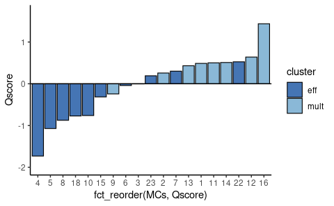

We’ll also add a boxplot, lets calculate statistics to add in the end.
Used a regular t test.

``` r
# Calculate statistics for boxplot
to.plot %>% 
  t_test( Qscore ~ cluster) %>% 
  add_xy_position(x = "cluster") -> stat.test
```

And make the boxplot. Used `ggpubr::stat_pvalue_manual` to add the
statistics.

``` r
p2 <- ggplot(to.plot, aes(x = cluster, y = Qscore, color = cluster ))+
  geom_boxplot(outlier.shape = NA, size = .8)+
  scale_color_manual(values = c("#4575B4" ,"#8AB8D7"))+
  geom_jitter(color = "black", width = .2)+
  stat_pvalue_manual(data = stat.test, label = "p", label.size = 4, hide.ns = T, tip.length = 0.02)+
  scale_y_continuous(limits = c(-2, 1.7))

p2
```

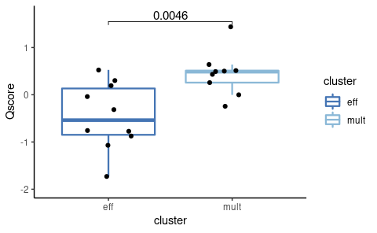

And finally; plotted together using `ggpubr::ggarrange`.

``` r
ggarrange(plotlist = list(p1,p2), ncol =  2, widths = c(2.2,1))
```


``` r
ggsave(here("Figs", "Barchart_Qscore.pdf"), device = "pdf", width = 8, height = 4)
```
