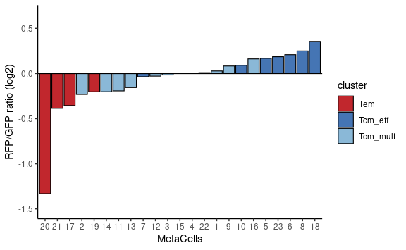
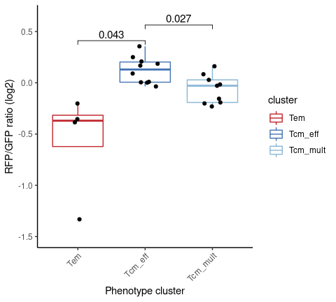
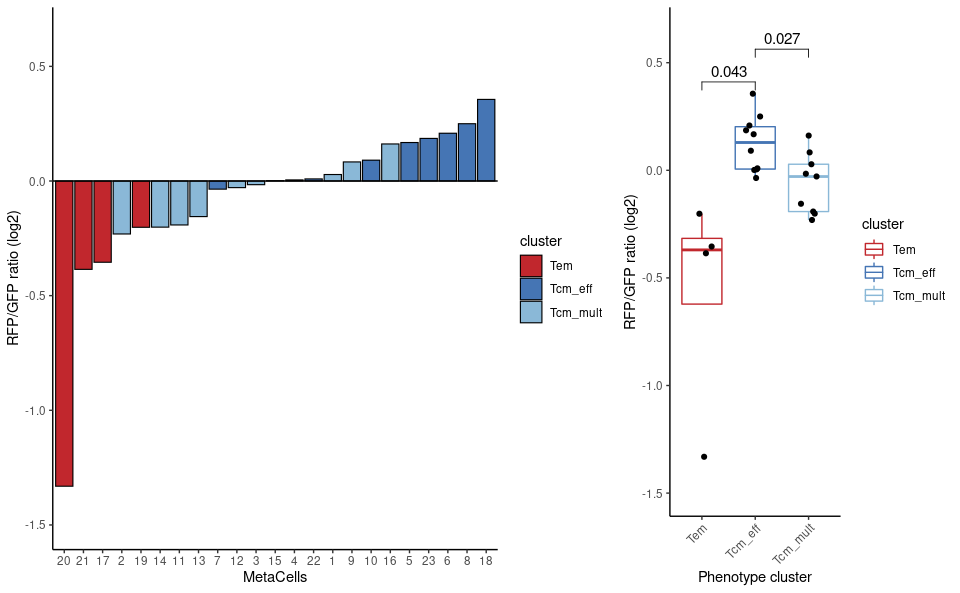

Identification of low-division and high-division Tcm
================
Kaspar Bresser
29/07/2021

-   [Prepare data](#prepare-data)
-   [Calculating DR<sup>RFP</sup> over DR<sup>GFP</sup>
    ratio’s](#calculating-drrfp-over-drgfp-ratios)
-   [Plotting the ratios](#plotting-the-ratios)

In the manuscript we use the DivisionRecorder to assess division history
within each MetaCell of our scRNAseq dataset. Below we describe the
processing steps performed to calculate the ratio’s from the scRNAseq
data, starting from the metacell and mat objects generated during the
MetaCell analysis.

We’ll start with importing the libraries used for plotting ect, and
import the data that we’ll use. To import the mat and mc objects with
the metacell package, we’ll have to point the package to the directory
where the objects are stored.

``` r
library(here)
library(tidyverse)
library(metacell)
library(ggpubr)
library(rstatix)

# point the metacell package to the data directory
scdb_init(here("Data"), force_reinit=T)

# import metacell objects
mc <- scdb_mc("DivRecMEM_MC")
clean.mat <- scdb_mat("DivRecMEM_clean")
```

# Prepare data

Lets start with getting all the data we need, starting with extracting
the cellcodes plus hashtag identities from the mat object.

``` r
clean.mat@cell_metadata %>% 
  rownames_to_column("cellcode") %>% 
  as_tibble %>% 
  dplyr::select(hash.ID, cellcode) %>% 
  mutate(hash.ID = as.character(hash.ID)) -> hashes

hashes
```

    ## # A tibble: 39,551 x 2
    ##    hash.ID cellcode            
    ##    <chr>   <chr>               
    ##  1 Doublet AAACCCAAGACTCTTG-1_1
    ##  2 Doublet AAACCCAAGCGTGAGT-1_1
    ##  3 Doublet AAACCCACAAATTAGG-1_1
    ##  4 Naive3  AAACCCACAACACGTT-1_1
    ##  5 Naive4  AAACCCACAATTTCTC-1_1
    ##  6 Naive4  AAACCCACACTCAAGT-1_1
    ##  7 DR7.GFP AAACCCAGTGCTCGTG-1_1
    ##  8 Doublet AAACCCATCCATAAGC-1_1
    ##  9 DR7.GFP AAACGAAAGAAGAGCA-1_1
    ## 10 Naive4  AAACGAAAGTCGGCCT-1_1
    ## # … with 39,541 more rows

Next we’ll retrieve the metacell-cellcode pairing information from the
mc object, using enframe() to get a dataframe, and subsequently join it
to the hashtag table.

``` r
enframe(mc@mc, "cellcode", "MC") %>% 
  left_join(hashes) %>% 
  mutate(MC = factor(MC)) -> hashes.MCs

hashes.MCs
```

    ## # A tibble: 27,559 x 3
    ##    cellcode             MC    hash.ID
    ##    <chr>                <fct> <chr>  
    ##  1 AAACCCACAACACGTT-1_1 14    Naive3 
    ##  2 AAACCCACAATTTCTC-1_1 16    Naive4 
    ##  3 AAACCCACACTCAAGT-1_1 16    Naive4 
    ##  4 AAACCCAGTGCTCGTG-1_1 23    DR7.GFP
    ##  5 AAACGAAAGAAGAGCA-1_1 1     DR7.GFP
    ##  6 AAACGAAAGTCGGCCT-1_1 12    Naive4 
    ##  7 AAACGAACACCTGCTT-1_1 12    DR6.GFP
    ##  8 AAACGAACAGCCGTCA-1_1 20    Naive3 
    ##  9 AAACGAAGTCACTACA-1_1 16    DR7.GFP
    ## 10 AAACGAAGTGCTATTG-1_1 13    Naive3 
    ## # … with 27,549 more rows

# Calculating DR<sup>RFP</sup> over DR<sup>GFP</sup> ratio’s

We will drill down on only on the cells that were transduced with the
DivisionRecorder, so lets get those experiment labels from the hashtags.

``` r
hash.tags <- grep(pattern = "GFP|RFP", x = unique(hashes.MCs$hash.ID), value = T)

hash.tags
```

    ##  [1] "DR7.GFP"  "DR6.GFP"  "DR67.RFP" "DR4.GFP"  "DR45.RFP" "DR5.GFP" 
    ##  [7] "DR3.RFP"  "DR3.GFP"  "DR1.RFP"  "DR1.GFP"  "DR2.RFP"  "DR2.GFP"

Next we’ll clean up the object, checking that there are no more
cellcodes that we ignored during clustering, filtering for the cells
from the DivisionRecorder experiments, and trashing any potential
`NA`’s.

``` r
hashes.MCs %>%
  # first filter unused cells and for HTO1-4, remove NAs
  filter(!(cellcode %in% as.character(clean.mat@ignore_cells))) %>%
  filter(hash.ID %in% hash.tags & !is.na(MC)) %>%
  # count MCs by HTO
  dplyr::count(MC, hash.ID) -> counts.per.MC

counts.per.MC
```

    ## # A tibble: 276 x 3
    ##    MC    hash.ID      n
    ##    <fct> <chr>    <int>
    ##  1 1     DR1.GFP     63
    ##  2 1     DR1.RFP    112
    ##  3 1     DR2.GFP    283
    ##  4 1     DR2.RFP    320
    ##  5 1     DR3.GFP     22
    ##  6 1     DR3.RFP     25
    ##  7 1     DR4.GFP     29
    ##  8 1     DR45.RFP    21
    ##  9 1     DR5.GFP     44
    ## 10 1     DR6.GFP     82
    ## # … with 266 more rows

A problem we encountered during when performing the experiment that
included mouse 4-7 was that DR<sup>RFP</sup> counts were very low,
forcing us to pool these populations, resulting in pools of mouse 4+5
and 6+7. Using the sort counts of these DR<sup>RFP</sup> populations, we
can add a correction factor that will allow us to pool the GFP
populations in silico.

``` r
counts.per.MC %>% 
  mutate(div.by = case_when( hash.ID == "DR5.GFP" ~ 3.4,
                             hash.ID == "DR6.GFP" ~ 3.77, 
                             TRUE ~ 1  ) ) %>%
  # correct and re-name GFP samples of the same day
  mutate(cor.count = n * div.by)%>%
  mutate(hash.ID = fct_collapse(.$hash.ID, DR45.GFP = c("DR4.GFP","DR5.GFP"),
                                DR67.GFP = c("DR6.GFP","DR7.GFP")  ))%>%
  # pool the GFP samples of the same day
  group_by(MC, hash.ID)%>%
  summarise(cor.count = sum(cor.count)) -> counts.per.MC.corrected

counts.per.MC.corrected
```

    ## # A tibble: 230 x 3
    ## # Groups:   MC [23]
    ##    MC    hash.ID  cor.count
    ##    <fct> <fct>        <dbl>
    ##  1 1     DR1.GFP        63 
    ##  2 1     DR1.RFP       112 
    ##  3 1     DR2.GFP       283 
    ##  4 1     DR2.RFP       320 
    ##  5 1     DR3.GFP        22 
    ##  6 1     DR3.RFP        25 
    ##  7 1     DR45.GFP      179.
    ##  8 1     DR45.RFP       21 
    ##  9 1     DR67.GFP      357.
    ## 10 1     DR67.RFP       17 
    ## # … with 220 more rows

Now the experiments have been properly joined, we can perform the final
steps. Now we want to normalize our data so we can compare the different
experiments (i.e Hashtags). We’ll normalize each hashtag to 1000 cells.
Once we’ve done that we’ll pool all RFP and GFP cells, respectively.
This way we’ll get 1 DR<sup>RFP</sup>/DR<sup>GFP</sup> per MetaCell

``` r
counts.per.MC.corrected %>% 
  group_by(hash.ID)%>%
  mutate(normalized.count = (cor.count/sum(cor.count))*1000 )%>%
  mutate(DivRec = ifelse(grepl( "RFP",hash.ID), "RFP", "GFP" )) %>% 
  # add together per MC and GFP/RFP
  group_by(MC, DivRec)%>%
  summarise(normalized.count = sum(normalized.count)) %>% 
  group_by(MC)%>%
  summarise(lab.ratio = sum(normalized.count[DivRec == "RFP"])/normalized.count[DivRec == "GFP"])  %>% 
  ungroup() -> lab.ratios

lab.ratios
```

    ## # A tibble: 23 x 2
    ##    MC    lab.ratio
    ##    <fct>     <dbl>
    ##  1 1         1.02 
    ##  2 2         0.852
    ##  3 3         0.989
    ##  4 4         1.00 
    ##  5 5         1.12 
    ##  6 6         1.16 
    ##  7 7         0.976
    ##  8 8         1.19 
    ##  9 9         1.06 
    ## 10 10        1.06 
    ## # … with 13 more rows

As a final touch, we’ll add the MetaCell phenotype clusters to the
tibble, so we can show that information in the plots.

``` r
lab.ratios %>% 
  mutate(cluster = factor(fct_collapse(.$MC,
                                Tcm_eff = c('23','15','22','8','6','10','4','5','7','18'),
                                Tcm_mult = c('9','1','12','13','14','16','11','2','3'),
                                Tem = c('21','19','17','20')), 
                          levels = c("Tem", "Tcm_eff", "Tcm_mult")  )  ) -> lab.ratios
lab.ratios
```

    ## # A tibble: 23 x 3
    ##    MC    lab.ratio cluster 
    ##    <fct>     <dbl> <fct>   
    ##  1 1         1.02  Tcm_mult
    ##  2 2         0.852 Tcm_mult
    ##  3 3         0.989 Tcm_mult
    ##  4 4         1.00  Tcm_eff 
    ##  5 5         1.12  Tcm_eff 
    ##  6 6         1.16  Tcm_eff 
    ##  7 7         0.976 Tcm_eff 
    ##  8 8         1.19  Tcm_eff 
    ##  9 9         1.06  Tcm_mult
    ## 10 10        1.06  Tcm_eff 
    ## # … with 13 more rows

# Plotting the ratios

Now we can put the data in a waterfall plot

``` r
p1 <- ggplot(lab.ratios, aes(x = fct_reorder(MC, lab.ratio), y = log2(lab.ratio), fill = cluster ))+
  geom_bar(stat = "identity", color = "black", size = .4)+
  geom_hline(yintercept = 0)+
  scale_fill_manual(values = c("#C1272D","#4575B4" ,"#8AB8D7"))+
  scale_y_continuous(limits = c(-1.5, 0.65))+
  labs(x = "MetaCells", y = "RFP/GFP ratio (log2)")

p1
```



Next calculate some statistics for the accompanying boxplot.

``` r
lab.ratios %>% 
  t_test( lab.ratio ~ cluster, p.adjust.method = "fdr") %>% 
  add_xy_position(x = "cluster") %>% 
  mutate(y.position = log2(y.position)) -> stat.test

stat.test
```

    ## # A tibble: 3 x 14
    ##   .y.       group1  group2     n1    n2 statistic    df     p p.adj p.adj.signif
    ##   <chr>     <chr>   <chr>   <int> <int>     <dbl> <dbl> <dbl> <dbl> <chr>       
    ## 1 lab.ratio Tem     Tcm_eff     4    10     -3.57  3.56 0.028 0.043 *           
    ## 2 lab.ratio Tem     Tcm_mu…     4     9     -2.37  3.55 0.085 0.085 ns          
    ## 3 lab.ratio Tcm_eff Tcm_mu…    10     9      2.95 17.0  0.009 0.027 *           
    ## # … with 4 more variables: y.position <dbl>, groups <named list>, xmin <dbl>,
    ## #   xmax <dbl>

And make the boxplot.

``` r
p2 <- ggplot(lab.ratios, aes(x = cluster, y = log2(lab.ratio), color = cluster ))+
  geom_boxplot(outlier.shape = NA)+
  scale_color_manual(values = c("#C1272D","#4575B4" ,"#8AB8D7"))+
  geom_jitter(color = "black", width = .2)+
  stat_pvalue_manual(data = stat.test, label = "p.adj", label.size = 4, hide.ns = T, tip.length = 0.02)+
  scale_y_continuous(limits = c(-1.5, .65))+
  theme(axis.text.x = element_text(angle = 45, hjust = 1))+
  labs(x = "Phenotype cluster", y = "RFP/GFP ratio (log2)")
p2
```



And finally, the for the last illustration, combine the waterfall and
boxplot.

``` r
ggarrange(plotlist = list(p1,p2), ncol =  2, widths = c(1.8,1))
```



``` r
ggsave(here("Figs", "labeling_ratios_AllWterm.pdf"), device = "pdf", width = 8, height = 4)
```

Also, write out the labeling ratio’s

``` r
write_tsv(lab.ratios, here("Output", "labeling_ratios.tsv"))
```
