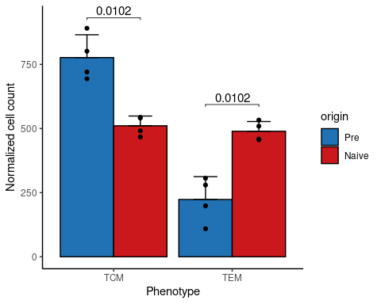
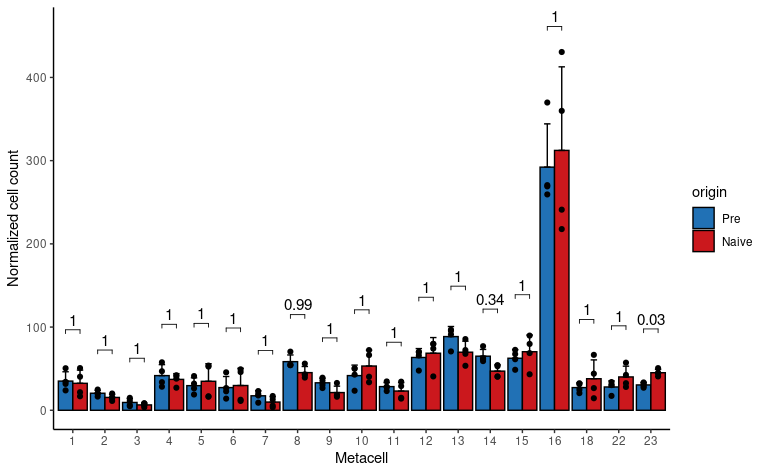

Compare modified vs unmodified memory T cells
================
Kaspar Bresser
01/09/2021

-   [Load packages and data](#load-packages-and-data)
-   [Get and tidy count data](#get-and-tidy-count-data)
-   [Compare counts Tcm/Tem](#compare-counts-tcmtem)
-   [Compare counts within Tcm](#compare-counts-within-tcm)

# Load packages and data

In the DivisionRecorder manuscript we performed single-cell sequencing
on CD8+ memory T cells generated from cells that were either (1)
modified with the DivisionRecorder or (2) not modified and directly
transferred from the donor mice.

In this analysis we’ll compare the relative amount of cells contributed
to each transcriptional state (i.e. MetaCell) by cells originating from
either modified or unmodified cells.

Start off with loading in the required packages and the data used in the
analysis.

We’ll need the metacell object (containing cellcode-MC pairs), and the
mat object (generated during the metacell pipeline, will contain hashtag
identities).

``` r
library(here)
library(tidyverse)
library(metacell)
library(rstatix)
library(ggpubr)
library(RColorBrewer)

# point the metacell package to the data directory
scdb_init(here("Data"), force_reinit=T)

# import metacell objects
mc <- scdb_mc("DivRecMEM_MC")
clean_mat <- scdb_mat("DivRecMEM_clean")
```

# Get and tidy count data

We can get the hashtag info from the mat objected generated during the
metacell pipeline. This is stored in the metadata slot.

``` r
colnames(clean_mat@cell_metadata)
```

    ##  [1] "orig.ident"                "nCount_RNA"               
    ##  [3] "nFeature_RNA"              "nCount_HTO"               
    ##  [5] "nFeature_HTO"              "nCount_ADT"               
    ##  [7] "nFeature_ADT"              "HTO_maxID"                
    ##  [9] "HTO_secondID"              "HTO_margin"               
    ## [11] "HTO_classification"        "HTO_classification.global"
    ## [13] "hash.ID"                   "experiment"               
    ## [15] "mito"                      "rp"                       
    ## [17] "RNA_snn_res.1"             "seurat_clusters"          
    ## [19] "S.Score"                   "G2M.Score"                
    ## [21] "Phase"                     "ident"                    
    ## [23] "amp_batch_id"

``` r
clean_mat@cell_metadata %>% 
  rownames_to_column("cellcode") %>% 
  dplyr::select(hash.ID, cellcode) %>% 
  mutate(hash.ID = as.character(hash.ID)) %>% 
  as_tibble() -> cells.df

cells.df
```

    ## # A tibble: 39,551 x 2
    ##    hash.ID cellcode            
    ##    <chr>   <chr>               
    ##  1 Doublet AAACCCAAGACTCTTG-1_1
    ##  2 Doublet AAACCCAAGCGTGAGT-1_1
    ##  3 Doublet AAACCCACAAATTAGG-1_1
    ##  4 Naive3  AAACCCACAACACGTT-1_1
    ##  5 Naive4  AAACCCACAATTTCTC-1_1
    ##  6 Naive4  AAACCCACACTCAAGT-1_1
    ##  7 DR7.GFP AAACCCAGTGCTCGTG-1_1
    ##  8 Doublet AAACCCATCCATAAGC-1_1
    ##  9 DR7.GFP AAACGAAAGAAGAGCA-1_1
    ## 10 Naive4  AAACGAAAGTCGGCCT-1_1
    ## # … with 39,541 more rows

Then we’ll combine the cellcode, hashID pairs with the metacell-IDs.
We’re only interested in cells that were assigned MetaCells.

``` r
enframe(mc@mc, "cellcode", "MC") %>% 
  left_join(cells.df) %>% 
  mutate(MC = factor(MC)) -> cells.df

cells.df
```

    ## # A tibble: 27,559 x 3
    ##    cellcode             MC    hash.ID
    ##    <chr>                <fct> <chr>  
    ##  1 AAACCCACAACACGTT-1_1 14    Naive3 
    ##  2 AAACCCACAATTTCTC-1_1 16    Naive4 
    ##  3 AAACCCACACTCAAGT-1_1 16    Naive4 
    ##  4 AAACCCAGTGCTCGTG-1_1 23    DR7.GFP
    ##  5 AAACGAAAGAAGAGCA-1_1 1     DR7.GFP
    ##  6 AAACGAAAGTCGGCCT-1_1 12    Naive4 
    ##  7 AAACGAACACCTGCTT-1_1 12    DR6.GFP
    ##  8 AAACGAACAGCCGTCA-1_1 20    Naive3 
    ##  9 AAACGAAGTCACTACA-1_1 16    DR7.GFP
    ## 10 AAACGAAGTGCTATTG-1_1 13    Naive3 
    ## # … with 27,549 more rows

These tibble now contains cells from both scRNAseq experiments performed
in the manuscript, but we only took along unmodified T cells in the
second experiment, so we’ll focus on that sequence run only.

Unmodified T cell samples are labeled as “Naive”, modified are labeled
DR(4-7). Also make sure there are no `NA`s stuck in the data somewhere.

``` r
(hash.tags <- grep(pattern = "DR[4|5|6|7]\\.GFP|Naive", x = unique(cells.df$hash.ID), value = T))
```

    ## [1] "Naive3"  "Naive4"  "DR7.GFP" "DR6.GFP" "DR4.GFP" "DR5.GFP" "Naive2" 
    ## [8] "Naive1"

``` r
cells.df %>%
  filter(hash.ID %in% hash.tags & !is.na(MC)) -> cells.df

cells.df
```

    ## # A tibble: 14,443 x 3
    ##    cellcode             MC    hash.ID
    ##    <chr>                <fct> <chr>  
    ##  1 AAACCCACAACACGTT-1_1 14    Naive3 
    ##  2 AAACCCACAATTTCTC-1_1 16    Naive4 
    ##  3 AAACCCACACTCAAGT-1_1 16    Naive4 
    ##  4 AAACCCAGTGCTCGTG-1_1 23    DR7.GFP
    ##  5 AAACGAAAGAAGAGCA-1_1 1     DR7.GFP
    ##  6 AAACGAAAGTCGGCCT-1_1 12    Naive4 
    ##  7 AAACGAACACCTGCTT-1_1 12    DR6.GFP
    ##  8 AAACGAACAGCCGTCA-1_1 20    Naive3 
    ##  9 AAACGAAGTCACTACA-1_1 16    DR7.GFP
    ## 10 AAACGAAGTGCTATTG-1_1 13    Naive3 
    ## # … with 14,433 more rows

Next, we can count the cells for each MC, hashID combination. And
calculate a normalized count by dividing each count by the total count
within each hashID.

``` r
cells.df %>% 
  dplyr::count(MC, hash.ID) %>%
  group_by(hash.ID)%>%
  mutate(normalized.count = (n/sum(n))*1000 ) %>%
  ungroup() -> cell.counts

cell.counts
```

    ## # A tibble: 184 x 4
    ##    MC    hash.ID     n normalized.count
    ##    <fct> <chr>   <int>            <dbl>
    ##  1 1     DR4.GFP    29            16.6 
    ##  2 1     DR5.GFP    44            22.9 
    ##  3 1     DR6.GFP    82            45.0 
    ##  4 1     DR7.GFP    48            27.4 
    ##  5 1     Naive1     12            10.1 
    ##  6 1     Naive2     12             9.10
    ##  7 1     Naive3     68            24.9 
    ##  8 1     Naive4     43            21.9 
    ##  9 2     DR4.GFP    20            11.4 
    ## 10 2     DR5.GFP    28            14.6 
    ## # … with 174 more rows

Finally we’ll add the group labels to the tibble. We’ll add global
phenotype (i.e. Tcm or Tem), sub-cluster (i.e. Tcm-eff, Tcm-mult, Tem),
and sample origin (i.e. modified and unmodified)

``` r
cell.counts %>% 
  mutate(cluster = fct_collapse(.$MC,
                                eff = c('23','15','22','8','6','10','4','5','7','18'),
                                mult = c('9','1','12','13','14','16','11','2','3'),
                                term = c('21','19','17','20')),
         phenotype = fct_collapse(.$MC,
                                TCM = c('23','15','22','8','6','10','4','5','7','18','9','1','12','13','14','16','11','2','3'),
                                TEM = c('21','19','17','20')), 
         origin = fct_collapse(.$hash.ID,
                              Naive = c('Naive1', 'Naive2', 'Naive3', 'Naive4'),
                              Pre = c('DR4.GFP','DR5.GFP','DR6.GFP','DR7.GFP'))  ) -> cell.counts
cell.counts
```

    ## # A tibble: 184 x 7
    ##    MC    hash.ID     n normalized.count cluster phenotype origin
    ##    <fct> <chr>   <int>            <dbl> <fct>   <fct>     <fct> 
    ##  1 1     DR4.GFP    29            16.6  mult    TCM       Pre   
    ##  2 1     DR5.GFP    44            22.9  mult    TCM       Pre   
    ##  3 1     DR6.GFP    82            45.0  mult    TCM       Pre   
    ##  4 1     DR7.GFP    48            27.4  mult    TCM       Pre   
    ##  5 1     Naive1     12            10.1  mult    TCM       Naive 
    ##  6 1     Naive2     12             9.10 mult    TCM       Naive 
    ##  7 1     Naive3     68            24.9  mult    TCM       Naive 
    ##  8 1     Naive4     43            21.9  mult    TCM       Naive 
    ##  9 2     DR4.GFP    20            11.4  mult    TCM       Pre   
    ## 10 2     DR5.GFP    28            14.6  mult    TCM       Pre   
    ## # … with 174 more rows

# Compare counts Tcm/Tem

Lets compare the normalized counts of Tcm and Tem between modified and
unmodified T cells.

First get summed counts for each sample (hashID).

``` r
cell.counts %>% 
  group_by(hash.ID, phenotype, origin) %>%  
  summarise(summed.count = sum(normalized.count)) %>% 
  ungroup() -> phenotype.counts

phenotype.counts
```

    ## # A tibble: 16 x 4
    ##    hash.ID phenotype origin summed.count
    ##    <chr>   <fct>     <fct>         <dbl>
    ##  1 DR4.GFP TCM       Pre            694.
    ##  2 DR4.GFP TEM       Pre            306.
    ##  3 DR5.GFP TCM       Pre            720.
    ##  4 DR5.GFP TEM       Pre            280.
    ##  5 DR6.GFP TCM       Pre            891.
    ##  6 DR6.GFP TEM       Pre            109.
    ##  7 DR7.GFP TCM       Pre            801.
    ##  8 DR7.GFP TEM       Pre            199.
    ##  9 Naive1  TCM       Naive          467.
    ## 10 Naive1  TEM       Naive          533.
    ## 11 Naive2  TCM       Naive          541.
    ## 12 Naive2  TEM       Naive          459.
    ## 13 Naive3  TCM       Naive          491.
    ## 14 Naive3  TEM       Naive          509.
    ## 15 Naive4  TCM       Naive          544.
    ## 16 Naive4  TEM       Naive          456.

Next we’ll calculate some statistics, used multiple T tests, followed by
bonferonni correction here.

Made use of the `add_xy_position` helper function from `rstatix` to add
the P values to the plot properly.

``` r
phenotype.counts %>% 
  group_by(phenotype) %>% 
  t_test(summed.count ~ origin ) %>%
  adjust_pvalue(method = "bonferroni") %>%
  add_significance("p.adj") %>% 
  add_xy_position(fun = "mean_sd", x = "phenotype", dodge = 0.9) %>% 
  mutate(p.adj = round(p.adj, 4)) -> stat.test
stat.test
```

    ## # A tibble: 2 x 16
    ##   phenotype .y.         group1 group2    n1    n2 statistic    df       p  p.adj
    ##   <fct>     <chr>       <chr>  <chr>  <int> <int>     <dbl> <dbl>   <dbl>  <dbl>
    ## 1 TCM       summed.cou… Pre    Naive      4     4      5.50  4.06 0.00509 0.0102
    ## 2 TEM       summed.cou… Pre    Naive      4     4     -5.50  4.06 0.00509 0.0102
    ## # … with 6 more variables: p.adj.signif <chr>, y.position <dbl>,
    ## #   groups <named list>, x <dbl>, xmin <dbl>, xmax <dbl>

And now for the plot. First, retrieve some colors to use.

Use `geom_bar` to plot the group means, and `stat_summary` to add the
standard deviation. Also add the individual data points, and use
`stat_pvalue_manual` from `ggpubr` to add the P values.

``` r
cols <- c(brewer.pal(8, "Blues")[5:8], brewer.pal(8, "Reds")[5:8])

ggplot(phenotype.counts, aes(x = phenotype, y = summed.count) )+
  geom_bar( stat = "summary", fun = "mean", position = "dodge", color = "black", aes(fill = origin))+
  scale_fill_manual(values= cols[c(3,7)] )+
  stat_summary(geom = "errorbar", fun = mean,
               fun.min = function(x) mean(x), 
               fun.max = function(x) mean(x) + sd(x), 
               width = 0.4, position = position_dodge(width = 0.9), aes(group = origin) )+
  labs(x = "Phenotype", y = "Normalized cell count")+
  geom_jitter( position = position_dodge(width = 0.9) ,aes(group = origin))+
  stat_pvalue_manual(data = stat.test,  label = "p.adj", tip.length = 0.01,hide.ns = TRUE, label.size = 4 )
```



``` r
ggsave( here("Figs","GroupedBarchart_TCM_TEM.pdf"), width = 4, height = 4)
```

# Compare counts within Tcm

Next we’ll compare counts between the MetaCells that make up the Tcm
pool, which is the population we’re mainly interested in.

To make a nice comparison we’ll first filter on Tcm, and then
re-normalize within hashID’s to really look at relative sizes within the
Tcm pool.

``` r
cell.counts %>% 
  filter(phenotype == "TCM") %>% 
  # MC now contains empty levels, lets drop those
  mutate(MC = fct_drop(MC)) %>% 
  group_by(hash.ID) %>% 
  mutate(norm.norm.counts = (normalized.count/sum(normalized.count))*1000 ) -> Tcm.counts

Tcm.counts
```

    ## # A tibble: 152 x 8
    ## # Groups:   hash.ID [8]
    ##    MC    hash.ID     n normalized.count cluster phenotype origin
    ##    <fct> <chr>   <int>            <dbl> <fct>   <fct>     <fct> 
    ##  1 1     DR4.GFP    29            16.6  mult    TCM       Pre   
    ##  2 1     DR5.GFP    44            22.9  mult    TCM       Pre   
    ##  3 1     DR6.GFP    82            45.0  mult    TCM       Pre   
    ##  4 1     DR7.GFP    48            27.4  mult    TCM       Pre   
    ##  5 1     Naive1     12            10.1  mult    TCM       Naive 
    ##  6 1     Naive2     12             9.10 mult    TCM       Naive 
    ##  7 1     Naive3     68            24.9  mult    TCM       Naive 
    ##  8 1     Naive4     43            21.9  mult    TCM       Naive 
    ##  9 2     DR4.GFP    20            11.4  mult    TCM       Pre   
    ## 10 2     DR5.GFP    28            14.6  mult    TCM       Pre   
    ## # … with 142 more rows, and 1 more variable: norm.norm.counts <dbl>

Calculate some statistics, used multiple T tests, followed by bonferonni
correction here.

Made use of the `add_xy_position` helper function from `rstatix` to add
the P values to the plot properly.

``` r
Tcm.counts %>% 
  group_by(MC) %>% 
  t_test(norm.norm.counts ~ origin ) %>%
  adjust_pvalue(method = "bonferroni") %>%
  add_significance("p.adj") %>%
  add_xy_position(fun = "mean_sd", x = "MC", dodge = 0.9) %>% 
  mutate(p.adj = round(p.adj, 2)) -> stat.test

stat.test
```

    ## # A tibble: 19 x 16
    ##    MC    .y.             group1 group2    n1    n2 statistic    df       p p.adj
    ##    <fct> <chr>           <chr>  <chr>  <int> <int>     <dbl> <dbl>   <dbl> <dbl>
    ##  1 1     norm.norm.coun… Pre    Naive      4     4     0.277  5.39 0.792    1   
    ##  2 2     norm.norm.coun… Pre    Naive      4     4     1.99   5.97 0.0938   1   
    ##  3 3     norm.norm.coun… Pre    Naive      4     4     1.13   4.35 0.318    1   
    ##  4 4     norm.norm.coun… Pre    Naive      4     4     0.610  4.52 0.571    1   
    ##  5 5     norm.norm.coun… Pre    Naive      4     4    -0.452  4.14 0.674    1   
    ##  6 6     norm.norm.coun… Pre    Naive      4     4    -0.203  5.13 0.847    1   
    ##  7 7     norm.norm.coun… Pre    Naive      4     4     1.73   5.98 0.135    1   
    ##  8 8     norm.norm.coun… Pre    Naive      4     4     2.42   5.96 0.0522   0.99
    ##  9 9     norm.norm.coun… Pre    Naive      4     4     2.47   5.43 0.0527   1   
    ## 10 10    norm.norm.coun… Pre    Naive      4     4    -1.01   5.21 0.359    1   
    ## 11 11    norm.norm.coun… Pre    Naive      4     4     0.950  4.25 0.393    1   
    ## 12 12    norm.norm.coun… Pre    Naive      4     4    -0.475  4.76 0.656    1   
    ## 13 13    norm.norm.coun… Pre    Naive      4     4     2.09   5.96 0.082    1   
    ## 14 14    norm.norm.coun… Pre    Naive      4     4     3.23   5.97 0.0181   0.34
    ## 15 15    norm.norm.coun… Pre    Naive      4     4    -0.695  4.49 0.521    1   
    ## 16 16    norm.norm.coun… Pre    Naive      4     4    -0.356  4.50 0.738    1   
    ## 17 18    norm.norm.coun… Pre    Naive      4     4    -0.915  3.37 0.421    1   
    ## 18 22    norm.norm.coun… Pre    Naive      4     4    -1.63   4.75 0.168    1   
    ## 19 23    norm.norm.coun… Pre    Naive      4     4    -5.73   5.45 0.00169  0.03
    ## # … with 6 more variables: p.adj.signif <chr>, y.position <dbl>,
    ## #   groups <named list>, x <dbl>, xmin <dbl>, xmax <dbl>

Use `geom_bar` to plot the group means, and `stat_summary` to add the
standard deviation. Also add the individual data points, and use
`stat_pvalue_manual` from `ggpubr` to add the P values.

``` r
ggplot(Tcm.counts,  aes(x = factor(MC, levels = unique(MC)), y = norm.norm.counts) )+
  geom_bar( stat = "summary", fun = "mean", position = "dodge", color = "black", aes(fill = origin))+
  scale_fill_manual(values= cols[c(3,7)] )+
  stat_summary(geom = "errorbar", fun = mean,
               fun.min = function(x) mean(x), 
               fun.max = function(x) mean(x) + sd(x), 
               width = 0.4, position = position_dodge(width = 0.9), aes(group = origin) )+
  labs(x = "Metacell", y = "Normalized cell count")+
  geom_jitter( position = position_dodge(width = 0.9), aes(group = origin))+
  stat_pvalue_manual(data = stat.test,  label = "p.adj", tip.length = 0.01,hide.ns = F, label.size = 4 )
```



``` r
ggsave(here("Figs", "GroupedBarchart_TCM_MCs.pdf"), width = 10, height = 4)
```
